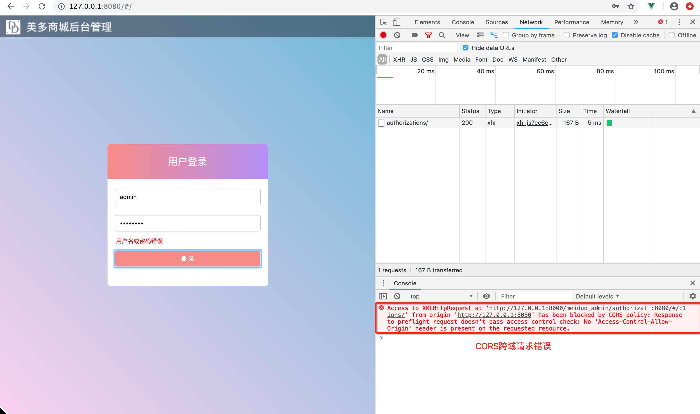

# CORS跨域请求

**本小节目标**：

- 理解跨域请求的概念以及浏览器CORS跨域请求限制
- 掌握使用corsheaders扩展包进行跨域请求设置

## CORS跨域

通过前端html界面点击`登录`按钮之后，浏览器产生了如下错误，这就是CORS跨域请求错误。



### 1. 跨域请求

1）同源地址

对于两个不同的url地址，如果其协议、域名和PORT完全一致，这样的地址就叫同源地址，否则就叫非同源地址。
例如：

```
  1. http://127.0.0.1:8080/
  2. http://127.0.0.1:8000/
```

2）跨域请求

当浏览器发起请求时，如果`源请求页面地址`和`被请求地址`不是同源地址，**那么这个请求就是跨域请求**。

3）CORS跨域请求限制

**浏览器在发起ajax跨域请求时，默认会有CORS跨域请求限制**。

浏览器在请求头中携带Origin请求头，表明源请求地址：

> Origin: 源请求地址

服务器在返回响应时，如果允许源地址对其进行跨域请求，需要在响应头中携带Access-Control-Allow-Origin响应头：

> Access-Control-Allow-Origin: 源请求地址

浏览器在收到响应时，如果发现响应头中没有Access-Control-Allow-Origin响应头，浏览器会直接将请求驳回，产生CORS跨域请求限制。

### 2. CORS跨域请求设置

项目中前端服务器与后端服务器分处不同的域名，需要为后端服务器添加跨域访问的支持。

Django项目中可以使用django-cors-headers扩展进行跨域请求设置。

1）安装

```python
pip install django-cors-headers
```

> [CORS扩展参考文档](https://github.com/ottoyiu/django-cors-headers/)

2）注册应用

```python
INSTALLED_APPS = (
    ...
    'corsheaders',
    ...
)
```

3）注册中间件

```python
MIDDLEWARE = [
    # 注意：此中间件添加到中间件的第一个
    'corsheaders.middleware.CorsMiddleware',
    ...
]
```

4）添加跨域请求白名单

```python
# CORS跨域请求设置
CORS_ORIGIN_WHITELIST = (
    # 备注：允许源地址`http://127.0.0.1:8080`向当前API服务器发起跨域请求
    'http://127.0.0.1:8080',
)
CORS_ALLOW_CREDENTIALS = True  # 允许携带cookie
```

- 凡是出现在白名单中的域名，都可以访问后端接口
- CORS_ALLOW_CREDENTIALS 指明在跨域访问中，后端是否支持对cookie的操作。

**总结**：

- 同源地址：协议、域名和端口完整相同的地址为同源地址
- 跨域请求：客户端发起请求时，如果源请求地址和被请求地址不同源，则请求就是跨域请求
- CORS跨域请求限制：浏览器针对ajax异步请求，会有CORS跨域请求限制
  - Origin
  - Access-Control-Allow-Origin
- CORS请求扩展包
  - 设置跨域请求白名单

## 三 CORS基本流程

浏览器将CORS请求分成两类：

- **简单请求（simple request）**
- **非简单请求（not-so-simple request**）。

### 浏览器发出简单请求CORS****

简单请求，只需要在头信息之中增加一个Origin字段。

### 浏览器发出非简单请求CORS

非简单请求，会在正式通信之前，增加一次HTTP查询请求，称为"预检"请求（preflight）。浏览器先询问服务器，当前网页所在的域名是否在服务器的许可名单之中，以及可以使用哪些HTTP动词和头信息字段。只有得到肯定答复，浏览器才会发出正式的XMLHttpRequest请求，否则就报错。

只要同时满足以下两大条件，就属于简单请求。

```
（1) 请求方法是以下三种方法之一：
HEAD
GET
POST
（2）HTTP的头信息不超出以下几种字段：
Accept
Accept-Language
Content-Language
Last-Event-ID
Content-Type：只限于三个值application/x-www-form-urlencoded、multipart/form-data、text/plain
```

凡是不同时满足上面两个条件，就属于非简单请求。

浏览器对这两种请求的处理，是不一样的。[都是Django的配置项下可以添加的内容]

```
* 简单请求和非简单请求的区别？
   简单请求：一次请求
   非简单请求：两次请求，在发送数据之前会先发一次请求用于做“预检”，只有“预检”通过后才再发送一次请求用于数据传输。
* 关于“预检”

- 请求方式：OPTIONS
- “预检”其实做检查，检查如果通过则允许传输数据，检查不通过则不再发送真正想要发送的消息
- 如何“预检”
     => 如果复杂请求是PUT等请求，则服务端需要设置允许某请求，否则“预检”不通过
        Access-Control-Request-Method
     => 如果复杂请求设置了请求头，则服务端需要设置允许某请求头，否则“预检”不通过
        Access-Control-Request-Headers
```

**支持跨域，简单请求**

服务器设置响应头：Access-Control-Allow-Origin = '域名' 或 '*'

**支持跨域，复杂请求**

由于复杂请求时，首先会发送“预检”请求，如果“预检”成功，则发送真实数据。

- “预检”请求时，允许请求方式则需服务器设置响应头：Access-Control-Request-Method

- “预检”请求时，允许请求头则需服务器设置响应头：Access-Control-Request-Headers

  

```python

def test(request):
    import json
    obj=HttpResponse(json.dumps({'name':'lqz'}))
    # obj['Access-Control-Allow-Origin']='*'
    obj['Access-Control-Allow-Origin']='http://127.0.0.1:8004'
    return obj
```

