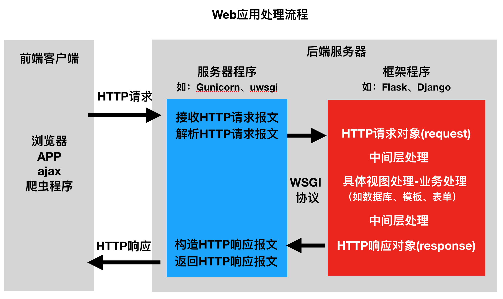

# 章节概述

在本章中，我们要给大家介绍DRF框架的前置基础知识。

**知识点概述**：

| 知识点                               | 说明                                            |
| ------------------------------------ | ----------------------------------------------- |
| web开发模式(前后端不分离&前后端分离) | 明确两种开发模式的特点和区别                    |
| Restful接口设计风格                  | 掌握Restful接口设计风格的关键点                 |
| API接口设计的思路                    | 掌握API接口设计的步骤                           |
| Django自定义RestAPI接口              | 掌握图书增、删、改、查(一个和多个)5个接口的实现 |
| 序列化和反序列化概念                 | 理解序列化和反序列化的概念                      |
| RestAPI接口的核心工作                | 明确RestAPI接口开发的核心工作                   |


## web开发的两种模式

在Web项目开发中，有两种开发模式：

- 前后端不分离
- 前后端分离

### 1. 前后端不分离


> 注：前端看到的效果都是由后端控制的，后端渲染页面之后给前端返回完整的页面，前端与后端的耦合度很高。

### 2. 前后端分离


> 注：
>
> 1. 后端仅返回前端所需的数据，至于数据怎么进行展示，由前端自己进行控制，前端与后端的耦合度很低。
> 2. API: 在前后端分离开发模式中，我们通常将后端开发的每个视图都称为一个**接口**或者**API**。

### 3. 开发模式对比

**区别**：

- 前后端不分离：完整的html页面是在后端生成的，后端给前端返回完整的页面，前端只是进行展示。
- 前后端分离：完整的html页面是在前端生成的，后端只给前端返回所需的数据，前端将数据填充在页面上。

**优缺点**：

| 开发模式     | 优点                   | 缺点                    |
| ------------ | ---------------------- | ----------------------- |
| 前后端不分离 | 利于SEO(搜索引擎优化)  | 仅适合于纯网页的应用    |
| 前后端分离   | 可以针对于不同的客户端 | 不利于SEO(搜索引擎优化) |

> SEO: 搜索引擎优化，是针对搜索引擎排名的一种优化手段，一个基础的优化点就是通过返回给客户端的页面内容上多加对应的关键字来提高搜索引擎排名。

**小结**：

- 前后端不分离：前端看到的效果是由后端控制的，后端模板渲染返回给客户端完整的页面。
- 前后端分离：后台只返回前端所需的数据，至于数据怎么展示，由前端自己进行控制。
- 前后端不分离适合于纯网页的应用，前后端分离可以适合于不同的客户端。

# Web 应用程序处理流程

> 学习目标:
>
> 了解 web 框架
>
> web 应用程序处理流程

### Web 应用程序处理流程



### Web 框架的意义

- 用于搭建 Web 应用程序
- 免去不同 Web 应用相同代码部分的重复编写，只需关心 Web 应用核心的业务逻辑实现

### Web 应用程序的本质

- 接收并解析 HTTP 请求 ，获取具体的请求信息
- 处理本次 HTTP 请求 ，即完成本次请求的业务逻辑处理
- 构造并返回处理结果 —— HTTP 响应

### 框架程序学习内容

- 如何搭建工程程序
  - 工程的组建
  - 工程的配置
  - 路由定义
  - 视图函数定义
- 如何获取请求数据（操作 request 对象）
- 如何构造响应数据（构造 response 对象）
- 如何使用中间层
- 框架提供的其他功能组件的使用
  - 数据库
  - 模板
  - admin

### 总结:

- web 框架的相关请求流程
- 前端: 发送请求
- 服务器: 接收请求
- web 框架: 处理请求
- 框架的意义: 减少重复造车轮, 减少重复性的步骤
- 框架的本质是: 接收请求, 处理逻辑, 返回响应
- django 学习的主要内容.


# REST接口开发的核心任务

**本小节学习目标**：

- 理解序列化和反序列化的概念
- 理解RestAPI开发的核心工作


## RestAPI开发核心工作

分析上节图书管理的5个API接口，可以发现，在开发REST API接口时，视图中做的最主要有三件事：

- 将请求的数据（如JSON格式）转换为模型类对象
- 操作数据库
- 将模型类对象转换为响应的数据（如JSON格式）

### 1. 序列化Serialization

在以上操作中，涉及到两个概念：**序列化和反序列化**。

1）序列化

**将程序中的一个数据结构类型转换为其他格式（字典、JSON、XML等），例如将Django中的模型类对象转换为字典或JSON字符串，这个转换过程我们称为序列化。**

如：

```python
queryset = BookInfo.objects.all()
book_list = []
# 序列化
for book in queryset:
    book_list.append({
        'id': book.id,
        'btitle': book.btitle,
        'bpub_date': book.bpub_date,
        'bread': book.bread,
        'bcomment': book.bcomment,
        'image': book.image.url if book.image else ''
    })
return JsonResponse(book_list, safe=False)
```

2）反序列化

**将其他格式（字典、JSON、XML等）转换为程序中的数据，例如将JSON字符串或字典转换保存为Django中的模型类对象，这个过程我们称为反序列化。**

如：

```python
json_bytes = request.body
json_str = json_bytes.decode()

# 反序列化
book_dict = json.loads(json_str)
book = BookInfo.objects.create(
    btitle=book_dict.get('btitle'),
    bpub_date=book_dict.get('bpub_date')
)
```

通过上节课的例子可以看到，**在开发REST API时，视图中要频繁的进行序列化与反序列化的操作。**

> 注：[维基百科](https://zh.wikipedia.org/wiki/序列化)中对于序列化的定义。

### 2. RestAPI核心工作说明

在开发REST API接口时，我们在**视图**中在做的最核心的事是：

- **将数据库数据序列化为前端所需要的格式，并返回。**
- **将前端发送的数据反序列化保存到模型类对象，并保存到数据库中。**

**总结**：

- 序列化：将对象转换为字典或者json的过程。
- 反序列化：将字典或json转换保存到对象中的过程。
- RestAPI核心工作：
  - 将数据库数据序列化为前端所需要的格式，并返回。
  - 将前端发送的数据反序列化保存到模型类对象，并保存到数据库中


# 为什么要序列化？

（这是一个广义的概念，不需要深究。）

思考：内存中的字典、列表、集合以及各种对象，如何保存到一个文件中。

设计一套协议，按照某种规则，把内存中的数据保存到文件中，文件是一个个字节序列。所以必须把数据额转换为字节序列，输出到文件，这就是序列化，反之，从文件的字节 序列恢复到内存中，就是反序列化。

## 1、Serialization定义

Serialization系列化，将内存中对象存储下来，把他变成一个个字节。二进制。

deSerialization反序列化，将文件的一个个字节到内存中。

序列胡保存到文件就是持久化。

可将数据序列化后持久化，或者网络传输，也可以将文件中或者网络接受到的字节序列反序列化。

## 2、pickle库

Python中的序列化、反序列化模块

dumps对象序列化为bytes对象

dump对象序列化到文件对象，就是存入到文件。

loads从bytes对象反序列化。

load对象反序列化，从文件读取数据.


## 3、Json

1)是一种轻量级的数据交换格式，基于ECMAScript（w3c制定的JS规范）的一个子集，采用完全独立于编程语言的文本格式来存储和表示数据。

2)数据类型

值

双引号引起来的字符串，数值，true和flase，null，对象，数组，这些都是值。

字符串

由双引号包围起来的任意字符的组合，可以有转义字符。

数值：有正负，整数，浮点数。

对象：无序的键值对的集合。

格式：{key1：value1，.....keyn：valuen}

Key必须是一个字符串，需要双引号包围这个字符。

Value可以是任意合法的值。

 

数组：有序的值的集合

格式：[value1,....valuen]

 

 

例子：

 

2)     json模块

Python与json

Python支持少量内建数据类型到json类型的转换。

| Python类型 | Json类型 |
| ---------- | -------- |
| True       | True     |
| False      | False    |
| None       | Null     |
| Str        | String   |
| Int        | Integer  |
| Float      | Float    |
| List       | Array    |
| Dict       | obiect   |

3)         常用的方法

| Python 类型 | Json类型                 |
| ----------- | ------------------------ |
| Dumps       | Json编码                 |
| Dump        | Json编码并写入文件       |
| Loads       | Json解码                 |
| Load        | Json解码，从文件读取数据 |

## 结论：

#### 序列化应用：一般来说，*本地序列化的情况，应用较少，大多数都是用在网络传输上面的*。

- 将数据序列化后通过网络传输到远程节点，远程服务器上的服务将接受到的数据反序列化后，就可以使用了。

但是，要注意的是，远程接收端，反序列化时候必须有对应的数据类型，否则就会报错。尤其是自己定义的类。必须远程得有一致的定义。

#### *一般json编码的数据就很少落地，数据都是通过网络传输。传输的时候要考虑压缩。本质上来说就是一个文本，就是个字符串。*

Json很简单，几乎语言编程都支持json，所以应用范围十分广泛。


# RESTful风格

**本小节学习目标**：

- 理解RestAPI接口设计风格的关键点
- 了解RestAPI接口设计风格的其他内容

## RestAPI接口设计风格

在进行API接口设计时，不同的开发人员可能有不同的设计风格，风格迥异。

那是否存在一种统一的接口设计方式，被广大开发人员所接受呢？

答: **这就是被普遍采用的RESTful API设计风格**。

### 1. Restful风格设计-关键点

#### 1. URL路径

*URL地址尽量使用名词复数*，*不要使用动词*。

##### 例如：

```http
# 不好的例子
/getProducts
/listOrders

# 正确的例子
GET /products：将返回所有产品信息
POST /products：将新建产品信息
GET /products/4：将获取产品4
PUT /products/4：将更新产品4
```

> 路径又称"终点"（endpoint），表示API的具体网址，每个网址代表一种资源（resource）。

#### 2. 请求方式

**访问同一个URL地址，采用不同的请求方式，代表要执行不同的操作**。


常用的HTTP请求方式有下面四个：

| 请求方式 | 说明                     |
| -------- | ------------------------ |
| GET      | 获取资源数据(单个或多个) |
| POST     | 新增资源数据             |
| PUT      | 修改资源数据             |
| DELETE   | 删除资源数据             |

##### 例如：

```http
GET /books：列出所有图书数据
POST /books：新建一本图书数据
GET /books/<id>/：获取某个指定的图书数据
PUT /books/<id>/：更新某个指定的图书数据
DELETE /books/<id>/：删除某个指定的图书数据
```


#### 3. 过滤信息


**过滤参数可以放在查询字符串中**。

在访问API接口获取数据时，可能需要对数据进行过滤。

##### 常见的参数：

```http
?limit=10：指定返回记录的数量
?offset=10：指定返回记录的开始位置。
?page=2&pagesize=100：指定第几页，以及每页的记录数。
?sortby=name&order=asc：指定返回结果按照哪个属性排序，以及排序顺序。
```


#### 4. 响应数据

**针对不同操作，服务器向用户返回不同的响应数据**。

##### 一般遵循以下规范：

```http
1. 获取一组数据，返回一组数据
2. 获取指定数据，返回指定数据
3. 新增数据，返回新增的数据
4. 修改数据，返回修改的数据
5. 删除数据，返回空
```


#### 5. 响应数据格式

**服务器返回的响应数据格式，*应该尽量使用JSON***。


#### 6. 响应状态码

##### 服务器向客户端返回的状态码和提示信息，常见的状态码如下：

```http
200 OK - [GET/PUT]：服务器成功返回用户请求的数据
201 CREATED - [POST]：用户新建数据成功。
204 NO CONTENT - [DELETE]：用户删除数据成功。
400 INVALID REQUEST - [POST/PUT]：用户发出的请求有错误，服务器没有进行新建或修改数据的操作
404 NOT FOUND - [*]：用户发出的请求针对的是不存在的记录，服务器没有进行操作，该操作是幂等的。。
500 INTERNAL SERVER ERROR - [*]：服务器发生错误，用户将无法判断发出的请求是否成功。
```

状态码的完全列表参见[这里](http://www.w3.org/Protocols/rfc2616/rfc2616-sec10.html)或[这里](https://zh.wikipedia.org/wiki/HTTP状态码)。


### 2. Restful风格设计-其他

#### 1. 域名

<font color='red'>应该尽量将API部署在专用域名之下。</font>

```http
https://api.example.com
```

如果确定API很简单，不会有进一步扩展，可以考虑放在主域名下。

```http
https://www.example.com/api/
```

#### 2. 版本

应该将API的版本号放入URL。

```http
http://www.example.com/api/1.0/foo

http://www.example.com/api/1.1/foo

http://www.example.com/api/2.0/foo
```

另一种做法是，将版本号放在HTTP头信息中，但不如放入URL方便和直观。[Github](https://developer.github.com/v3/media/#request-specific-version)采用这种做法。

#### 3. 错误处理

如果状态码是4xx，服务器就应该向用户返回出错信息。

```json
{
    error: "<error message>"
}
```

#### 4. 超媒体

RESTful API最好做到Hypermedia（即返回结果中提供链接，指向其他API方法），使得用户不查文档，也知道下一步应该做什么。

比如，Github的API就是这种设计，访问[api.github.com](https://api.github.com/)会得到一个所有可用API的网址列表。

```json
{
    "current_user_url": "https://api.github.com/user",
    "authorizations_url": "https://api.github.com/authorizations",
    // ...
}
```

从上面可以看到，如果想获取当前用户的信息，应该去访问[api.github.com/user](https://api.github.com/user)，然后就得到了下面结果。

```json
{
    "message": "Requires authentication",
    "documentation_url": "https://developer.github.com/v3"
}
```

上面代码表示，服务器给出了提示信息，以及文档的网址。

**总结**：

| 要点         |                                                              |
| :----------- | :----------------------------------------------------------- |
| url地址      | url地址尽量使用名词复数，不要使用动词                        |
| 请求方式     | 执行不同的操作，采用不同的请求方式： GET(获取) POST(新增) PUT(修改) DELETE(删除) |
| 过滤参数     | 过滤参数放在查询字符串中                                     |
| 响应数据     | 获取多个数据时，返回对应的多个数据 获取单个数据时，返回对应的单个数据 新增数据时，将新增的数据返回 修改数据时，将修改的数据返回 删除数据时，返回空 |
| 响应数据格式 | JSON                                                         |
| 响应状态码   | 200(获取或修改成功) 201(新增成功)  204(删除成功)  404(资源找不到) 500(服务器出错) |

# Django REST framework 简介

### 1. 作用

**Django REST framework可以帮助我们大大提高REST API的开发速度。**

> 注：DRF框架内容封装了很多东西，目的就是简化开发代码的编写，提高API接口的开发速度。

**举例**：

1）在序列化与反序列化时，虽然操作的数据可能不同，但是过程却是相似的，这部分操作DRF框架进行了封装。

2）在开发REST API的视图时，虽然每个视图操作的数据可能不同，但增、删、改、查的基本流程是一样的，这部分代码DRF框架也进行了封装。

- **增**：校验请求数据 -> 反序列化-将数据保存到对象中 -> 保存数据到数据库 -> 将保存的对象序列化返回
- **删**：判断要删除的数据是否存在 -> 执行数据库删除 -> 返回响应
- **改**：判断要修改的数据是否存在 -> 校验请求的数据 -> 反序列化-将数据保存到对象中 -> 保存数据库 -> 将保存的对象序列化返回
- **查(1个或多个)**：查询数据库 -> 将数据序列化并返回

### 2. 简介

Django REST framework 框架是一个用于构建Web API 的强大而又灵活的工具。通常简称为DRF框架 或 REST framework。

### 3. 特点

- **提供了定义序列化器Serializer的方法，可以快速根据 Django ORM 或者其它库自动序列化/反序列化**
- **提供了丰富的类视图、Mixin扩展类、子类视图、视图集，简化视图代码的编写**
- 多种身份认证和权限控制方式的支持
- 内置了限流系统
- 直观的 API web 界面
- 可扩展性，插件丰富

**总结**：

- 作用：快速开发RestAPI接口。
- 特点：进行了大量封装，提高API开发速度。
- 核心功能：序列化器和视图。


# 环境安装与使用

```shell
pip install djangorestframework
```

```python
INSTALLED_APPS = [
    ...
    'rest_framework',
]
```


# DRF框架功能演示

**本小节学习目标**：

- 了解DRF框架的一些名词：

  ### 视图集、序列化器、路由Router

## 功能演示

> 注：此案例仅做DRF框架功能演示使用，现阶段不需要深究代码。

使用Django REST framework快速实现图书管理的5个RestAPI。

### 1. 创建序列化器类

在`booktest`应用中新建`serializers.py`用于保存该应用的序列化器类。

```python
class BookInfoSerializer(serializers.ModelSerializer):
    """图书序列化器类"""
    class Meta:
        model = BookInfo
        fields = '__all__'
```

- **model**：指定该序列化器类所对应的模型类
- **fields**：指定依据模型类的哪些字段生成对应序列化器类的字段，`__all__`代表所有


### 2. 编写视图

在`booktest`应用的`views.py`中创建视图`BookInfoViewSet`，这是一个视图集合。

```python
from rest_framework.viewsets import ModelViewSet
from booktest.serializers import BookInfoSerializer
from booktest.models import BookInfo

class BookInfoViewSet(ModelViewSet):
    """视图集"""
    queryset = BookInfo.objects.all()
    serializer_class = BookInfoSerializer
```

- **queryset**：指定视图集在进行数据查询时所使用的查询集
- **serializer_class**：指定视图集在进行序列化或反序列化时所使用的序列化器类


### 3. 定义路由

在`booktest`应用的`urls.py`中进行URL配置。

```python
from booktest import views
from rest_framework.routers import DefaultRouter

urlpatterns = [
    ...
]

# 路由Router: 动态生成视图集中处理函数的url配置项
router = DefaultRouter()  # 路由Router
router.register('books', views.BookInfoViewSet, base_name='books')  # 向路由Router中注册视图集

urlpatterns += router.urls  # 将路由Router生成的url配置信息添加到django的路由列表中
```


# 序列化器

## 章节概述

在本章中，我们会给大家讲解DRF框架中序列化器的使用。

**知识点概述**：

| 知识点                                                       | 说明                                                         |
| ------------------------------------------------------------ | ------------------------------------------------------------ |
| 序列化器的定义和使用： 1. 序列化器类的定义格式 2. 序列化器类的基本使用 3. 序列化器类字段常用的选项参数 | 1. 掌握序列化器类基本定义格式 2. 掌握序列化类使用的基本形式(序列化和反序列化) 3. 理解序列化器定义时，常用的字段选项参数 |
| 序列化功能： 1. 序列化单个对象 2. 序列化多个对象 3. 关联对象的嵌套序列化 | 1. 掌握单个对象的序列化操作 2. 掌握多个对象的序列化操作 3. 掌握关联对象嵌套序列化的3种方式 |
| 反序列化功能： 1. 反序列化-基本数据校验 2. 反序列化-补充数据校验 3. 反序列化-数据保存(新增和更新) | 1. 掌握反序列化-数据校验的基本使用形式 2. 掌握反序列化-补充数据校验的3种方式 3. 掌握反序列化-数据保存时的新增和更新操作 |
| ModelSerializer类的使用                                      | 掌握ModelSerializer的使用场景及基本使用形式                  |
| 序列化器改写图书管理RestAPI接口                              | 理解使用序列化器改写图书管理的API接口                        |


[
](#)


## 序列化器类定义


### 1. 序列化器功能

- 序列化：将实例对象转换为字典
- 反序列化
  - 数据校验
  - 数据保存-新增和更新


### 2. 序列化器类定义

基本形式：

```python
# 模型类定义
from django.db import models

class 模型类名(models.Model):
  # 模型类字段 = models.字段类型(选项参数)
  # ...

# 序列化器类定义
from rest_framework import serializers

class 序列化器类名(serializers.Serializer):
    # 序列化器字段 = serializers.字段类型(选项参数)
    # ...
```


例如：

```python
# tests.py
class User(object):
    """用户类"""
    def __init__(self, name, age):
        self.name = name
        self.age = age

class UserSerializer(serializers.Serializer):
    """用户序列化器类"""
    name = serializers.CharField()
    age = serializers.IntegerField()
```

> 注：UserSerializer可以针对User进行数据的序列化和反序列化操作。
>
> 注：运行一个单独的py文件，而该py文件中需要使用Django中的东西，则需要在py文件的开头添加以下代码：

```python
# 设置Django运行所依赖的环境变量
import os
if not os.environ.get('DJANGO_SETTINGS_MODULE'):
  os.environ.setdefault('DJANGO_SETTINGS_MODULE', 'drf_demo.settings')

# 让Django进行一次初始化
import django
django.setup()
```


### 3. 序列化器基本使用

**使用序列化器时需要先创建一个序列化器类的对象**。

创建：

```python
序列化器类(instance=None, data=empty, **kwarg)
```


说明：

1）用于序列化时，将实例对象传给**instance**参数

2）用于反序列化时，将要被反序列化的数据传给**data**参数

### 4. 案例演示

1）序列化操作

```python
# 创建User对象
user = User(name='smart', age=18)

# 使用UserSerializer将user对象序列化为如下字段数据：{'name': 'smart', 'age': 18}
serializer = UserSerializer(user)

# 获取序列化之后的数据
serializer.data
```

2）反序列化操作-数据校验

```python
# 准备数据
data = {'name': 'admin', 'age': 30}

# 使用UserSerializer对data中的数据进行反序列化校验
serializer = UserSerializer(data=data)

# 调用is_valid进行数据校验，成功返回True，失败返回False
serializer.is_valid()

# 获取校验失败之后的错误提示信息
serializer.errors

# 获取校验通过之后的数据
serializer.validated_data
```


### 5. 字段类型和选项参数

**常用字段类型**：

| 字段                    | 字段构造方式                                                 |
| ----------------------- | ------------------------------------------------------------ |
| **BooleanField**        | BooleanField()                                               |
| **NullBooleanField**    | NullBooleanField()                                           |
| **CharField**           | CharField(max_length=None, min_length=None, allow_blank=False, trim_whitespace=True) |
| **EmailField**          | EmailField(max_length=None, min_length=None, allow_blank=False) |
| **RegexField**          | RegexField(regex, max_length=None, min_length=None, allow_blank=False) |
| **SlugField**           | SlugField(max_length=50, min*length=None, allow_blank=False) 正则字段，验证正则模式 [-a-zA-Z0-9*-]+ |
| **URLField**            | URLField(max_length=200, min_length=None, allow_blank=False) |
| **UUIDField**           | UUIDField(format='hex_verbose')  format:  1) `'hex_verbose'` 如`"5ce0e9a5-5ffa-654b-cee0-1238041fb31a"`  2） `'hex'` 如 `"5ce0e9a55ffa654bcee01238041fb31a"`  3）`'int'` - 如: `"123456789012312313134124512351145145114"`  4）`'urn'` 如: `"urn:uuid:5ce0e9a5-5ffa-654b-cee0-1238041fb31a"` |
| **IPAddressField**      | IPAddressField(protocol='both', unpack_ipv4=False, **options) |
| **IntegerField**        | IntegerField(max_value=None, min_value=None)                 |
| **FloatField**          | FloatField(max_value=None, min_value=None)                   |
| **DecimalField**        | DecimalField(max_digits, decimal_places, coerce_to_string=None, max_value=None, min_value=None) max_digits: 最多位数 decimal_palces: 小数点位置 |
| **DateTimeField**       | DateTimeField(format=api_settings.DATETIME_FORMAT, input_formats=None) |
| **DateField**           | DateField(format=api_settings.DATE_FORMAT, input_formats=None) |
| **TimeField**           | TimeField(format=api_settings.TIME_FORMAT, input_formats=None) |
| **DurationField**       | DurationField()                                              |
| **ChoiceField**         | ChoiceField(choices) choices与Django的用法相同               |
| **MultipleChoiceField** | MultipleChoiceField(choices)                                 |
| **FileField**           | FileField(max_length=None, allow_empty_file=False, use_url=UPLOADED_FILES_USE_URL) |
| **ImageField**          | ImageField(max_length=None, allow_empty_file=False, use_url=UPLOADED_FILES_USE_URL) |
| **ListField**           | ListField(child=, min_length=None, max_length=None)          |
| **DictField**           | DictField(child=)                                            |

**通用参数**：无论哪种字段类型都可以使用的选项参数。

| 参数名称           | 说明                                     |
| ------------------ | ---------------------------------------- |
| **read_only**      | 表明该字段仅用于序列化输出，默认False    |
| **write_only**     | 表明该字段仅用于反序列化输入，默认False  |
| **required**       | 表明该字段在反序列化时必须输入，默认True |
| **default**        | 序列化和反序列化时使用的默认值           |
| **error_messages** | 包含错误编号与错误信息的字典             |
| **label**          | 用于HTML展示API页面时，显示的字段名称    |

注：定义序列化器类的字段时，如果没有指定read_only和write_only，则这两个参数默认值都为False，表明对应的字段既在序列化时使用，也在反序列化时使用。


`read_only示例`：

```python
from rest_framework import serializers


class User(object):
    """用户类"""
    def __init__(self, name, age):
        self.name = name
        self.age = age


class UserSerializer(serializers.Serializer):
    """序列化器类"""
    name = serializers.CharField()
    age = serializers.IntegerField(read_only=True)


if __name__ == "__main__":
    # 准备数据
    data = {'name': 'laowang', 'age': 18}

    # 数据校验
    serializer = UserSerializer(data=data)
    res = serializer.is_valid()

    print('校验结果：%s' % res)

    # 如果校验失败，获取校验失败的错误原因
    print(serializer.errors)

    # 如果校验成功，获取校验之后的数据
    print(serializer.validated_data)
```

`示例结果`： 

`write_only示例`：

```python
from rest_framework import serializers


class User(object):
    """用户类"""
    def __init__(self, name, age):
        self.name = name
        self.age = age


class UserSerializer(serializers.Serializer):
    """序列化器类"""
    name = serializers.CharField()
    age = serializers.IntegerField(write_only=True)

if __name__ == "__main__":
    # 创建user对象
    user = User('smart', 18)

    # 将user对象序列化为字典{'name': 'smart', 'age': 18}
    serializer = UserSerializer(user)

    # serializer.data获取序列化之后的字典数据
    print(serializer.data)
```

`示例结果`： 

`required示例`：

```python
from rest_framework import serializers


class User(object):
    """用户类"""
    def __init__(self, name, age):
        self.name = name
        self.age = age


class UserSerializer(serializers.Serializer):
    """序列化器类"""
    name = serializers.CharField()
    age = serializers.IntegerField()


if __name__ == "__main__":
    # 准备数据
    data = {'name': 'laowang'}

    # 数据校验
    serializer = UserSerializer(data=data)
    res = serializer.is_valid()

    print('校验结果：%s' % res)

    # 如果校验失败，获取校验失败的错误原因
    print(serializer.errors)

    # 如果校验成功，获取校验之后的数据
    print(serializer.validated_data)
```

## <font color=red> 反序列化需要校验数据 所以.validated是反序列化，.data的是序列化</font>

`示例结果`： 

`将上面示例中age字段的required设置为False`：

```python
from rest_framework import serializers


class User(object):
    """用户类"""
    def __init__(self, name, age):
        self.name = name
        self.age = age


class UserSerializer(serializers.Serializer):
    """序列化器类"""
    name = serializers.CharField()
    age = serializers.IntegerField(required=False)


if __name__ == "__main__":
    # 准备数据
    data = {'name': 'laowang'}

    # 数据校验
    serializer = UserSerializer(data=data)
    res = serializer.is_valid()

    print('校验结果：%s' % res)

    # 如果校验失败，获取校验失败的错误原因
    print(serializer.errors)

    # 如果校验成功，获取校验之后的数据
    print(serializer.validated_data)
```

`示例结果`： 

```
default示例`：
`序列化时所使用的默认值：
from rest_framework import serializers


class User(object):
    """用户类"""
    def __init__(self, name, age):
        self.name = name
        self.age = age


class UserSerializer(serializers.Serializer):
    """序列化器类"""
    name = serializers.CharField()
    age = serializers.IntegerField()
    addr = serializers.CharField(default='默认地址')

if __name__ == "__main__":
    # 创建user对象
    user = User('smart', 18)

    # 将user对象序列化为字典{'name': 'smart', 'age': 18}
    serializer = UserSerializer(user)

    # serializer.data获取序列化之后的字典数据
    print(serializer.data)
```

`示例结果`： 

> 注：如果user对象有addr属性，则序列化之后的字典中addr的值不再使用default设置的默认值。

```
反序列化时所使用的默认值：
from rest_framework import serializers


class User(object):
    """用户类"""
    def __init__(self, name, age):
        self.name = name
        self.age = age


class UserSerializer(serializers.Serializer):
    """序列化器类"""
    name = serializers.CharField()
    age = serializers.IntegerField(required=False, default=20)

if __name__ == "__main__":
    # 准备数据
    data = {'name': 'laowang'}

    # 数据校验
    serializer = UserSerializer(data=data)
    res = serializer.is_valid()

    print('校验结果：%s' % res)

    # 如果校验失败，获取校验失败的错误原因
    print(serializer.errors)

    # 如果校验成功，获取校验之后的数据
    print(serializer.validated_data)
```

`示例结果`： 

> 注：如果反序列化时传递的data中包含age，则反序列化之后的字典中age的值不再使用default设置的默认值。

### **常用参数**：

| 参数名称       | 作用     |
| -------------- | -------- |
| **max_length** | 最大长度 |
| **min_length** | 最小长度 |
| **max_value**  | 最大值   |
| **min_value**  | 最小值   |

> max_length和min_length是针对字符串类型的参数；max_value和min_value是针对数字类型的参数。


### 6. 图书序列化器类定义

```python
class BookInfo(models.Model):
    btitle = models.CharField(max_length=20, verbose_name='名称')
    bpub_date = models.DateField(verbose_name='发布日期', null=True)
    bread = models.IntegerField(default=0, verbose_name='阅读量')
    bcomment = models.IntegerField(default=0, verbose_name='评论量')
    is_delete = models.BooleanField(default=False, verbose_name='删除标记')
```

定义一个和BookInfo对应的序列化器类:

```python
class BookInfoSerializer(serializers.Serializer):
    """图书数据序列化器"""
    id = serializers.IntegerField(label='ID', read_only=True)
    btitle = serializers.CharField(label='名称', max_length=20)
    bpub_date = serializers.DateField(label='发布日期')
    bread = serializers.IntegerField(label='阅读量', required=False)
    bcomment = serializers.IntegerField(label='评论量', required=False)
```

**总结**：

- 序列器类定义：
  - 继承自`serializers.Serializer`
  - 定义字段：`<字段名>=serializers.字段类型(选项参数)`
- 基本使用：
  - 创建序列化器类对象：serializer = <序列化器类>(instance, data, **kwargs)
  - 序列化时，将对象传递给instance
  - 反序列化时，将字典数据传递给data
- 选项参数：
  - write_only：为True，字段只在反序列化时使用
  - read_only：为True，字段只在序列化时使用
  - required：为True，如果字段在反序列化时使用，该字段必传传入
  - default：设置序列化和反序列化操作时的默认值
  - max_length和min_length：设置字符串的最大长度和最小长度
  - max_value和min_value：设置数字的最大值和最小值

### 6. 图书序列化器类定义

```python
class BookInfo(models.Model):
    btitle = models.CharField(max_length=20, verbose_name='名称')
    bpub_date = models.DateField(verbose_name='发布日期', null=True)
    bread = models.IntegerField(default=0, verbose_name='阅读量')
    bcomment = models.IntegerField(default=0, verbose_name='评论量')
    is_delete = models.BooleanField(default=False, verbose_name='删除标记')
```

定义一个和BookInfo对应的序列化器类:

```python
class BookInfoSerializer(serializers.Serializer):
    """图书数据序列化器"""
    id = serializers.IntegerField(label='ID', read_only=True)
    btitle = serializers.CharField(label='名称', max_length=20)
    bpub_date = serializers.DateField(label='发布日期')
    bread = serializers.IntegerField(label='阅读量', required=False)
    bcomment = serializers.IntegerField(label='评论量', required=False)
```

**总结**：

- 序列器类定义：
  - 继承自`serializers.Serializer`
  - 定义字段：`<字段名>=serializers.字段类型(选项参数)`
- 基本使用：
  - 创建序列化器类对象：serializer = <序列化器类>(instance, data, **kwargs)
  - 序列化时，将对象传递给instance
  - 反序列化时，将字典数据传递给data
- 选项参数：
  - write_only：为True，字段只在反序列化时使用
  - read_only：为True，字段只在序列化时使用
  - required：为True，如果字段在反序列化时使用，该字段必传传入
  - default：设置序列化和反序列化操作时的默认值
  - max_length和min_length：设置字符串的最大长度和最小长度
  - max_value和min_value：设置数字的最大值和最小值


# 序列化操作

**本小节学习目标**：

- 掌握单个对象的序列化和多个对象的序列化操作
- 掌握关联对象嵌套序列化的3种方式
- 掌握多关联对象嵌套序列化时many参数的使用

### 1. 序列化单个对象

序列化单个对象obj时，在创建序列化器对象时，将obj传递给instance即可。

```python
from booktest.models import BookInfo
from booktest.serializers import BookInfoSerializer
# 查询获取图书对象
book = BookInfo.objects.get(id=2)
# 创建序列化器对象
serializer = BookInfoSerializer(book)
# 获取序列化之后的数据
serializer.data
# {'id': 2, 'btitle': '天龙八部', 'bpub_date': '1986-07-24', 'bread': 36, 'bcomment': 40}
```

### 2. 序列化多个对象

如果要被序列化的是包含多个对象的查询集QuerySet或list，在创建序列化器对象时，需要添加`many=True`参数。

```python
books = BookInfo.objects.all()
# 创建序列化器对象
serializer = BookInfoSerializer(books, many=True)
# 获取序列化之后的数据
serializer.data
# [
#   OrderedDict([('id', 2), ('btitle', '天龙八部'), ('bpub_date', '1986-07-24'), ('bread', 36), ('bcomment', 40)),
#   OrderedDict([('id', 3), ('btitle', '笑傲江湖'), ('bpub_date', '1995-12-24'), ('bread', 20), ('bcomment', 80)),
#   OrderedDict([('id', 4), ('btitle', '雪山飞狐'), ('bpub_date', '1987-11-11'), ('bread', 58), ('bcomment', 24)),
#   OrderedDict([('id', 5), ('btitle', '西游记'), ('bpub_date', '1988-01-01'), ('bread', 10), ('bcomment', 10)])
# ]
```

> 注：OrderedDict是有序字典类型。


### 3. 关联对象嵌套序列化

如果在序列化对象数据时，需要将其关联的对象一并序列化，则定义序列化器类的字段时，需要在定义对应的关联对象嵌套序列化字段。

例如：在序列化英雄对象数据时，hbook(即和英雄关联的图书)字段如何序列化？

我们先定义HeroInfoSerialzier除关联对象嵌套序列化字段之外的其他部分

```python
class HeroInfoSerializer(serializers.Serializer):
    """英雄数据序列化器"""
    GENDER_CHOICES = (
        (0, 'male'),
        (1, 'female')
    )
    id = serializers.IntegerField(label='ID', read_only=True)
    hname = serializers.CharField(label='名字', max_length=20)
    hgender = serializers.ChoiceField(choices=GENDER_CHOICES, label='性别', required=False)
    hcomment = serializers.CharField(label='描述信息', max_length=200, required=False)
```

对于嵌套关联字段，可以采用以下3种方式进行定义：

1）**PrimaryKeyRelatedField**

**将关联对象序列化为关联对象的主键**。

```python
# 在HeroInfoSerializer中添加此字段
hbook = serializers.PrimaryKeyRelatedField(label='图书', read_only=True)
或
hbook = serializers.PrimaryKeyRelatedField(label='图书', queryset=BookInfo.objects.all())
```

指明字段时需要包含read_only=True或者queryset参数：

- 指定read_only=True参数时，该字段仅在序列化时使用。
- 指定queryset参数时，将被用作反序列化时参数校验使用。

序列化操作：

```python
from booktest.serializers import HeroInfoSerializer
from booktest.models import HeroInfo
hero = HeroInfo.objects.get(id=6)
serializer = HeroInfoSerializer(hero)
serializer.data
```

使用效果：

```python
# {
#     'id': 6,
#     'hname': '乔峰',
#     'hgender': 1,
#     'hcomment': '降龙十八掌',
#     'hbook': 2
# }
```

> 注：使用PrimaryKeyRelatedField将和英雄关联的图书hbook序列化为了hbook的主键。

2）**使用关联对象的序列化器**

使用指定的序列化器类将关联对象进行序列化。

```python
hbook = BookInfoSerializer()
```

使用效果：

```python
# {
#     'id': 6,
#     'hname': '乔峰',
#     'hgender': 1,
#     'hcomment': '降龙十八掌',
#     'hbook': {
#         'id': 2,
#         'btitle': '天龙八部',
#         'bpub_date': '1986-07-24',
#         'bread': 36,
#         'bcomment': 40
#     }
# }
```

> 注：使用BookInfoSerializer将和英雄关联的图书hbook进行序列化。

3) **StringRelatedField**

将关联对象序列化为关联对象模型类__str__方法的返回值。

```python
hbook = serializers.StringRelatedField(label='图书')
```

使用效果：

```python
# {
#     'id': 6,
#     'hname': '乔峰',
#     'hgender': 1,
#     'hcomment': '降龙十八掌',
#     'hbook': '天龙八部'
# }
```

> 注：将和英雄关联的图书hbook序列化为图书模型类__str__方法的返回值。

### 4. many参数

如果和一个对象关联的对象有多个，在序列化器类中定义嵌套序列化字段时，需要多添加一个many=True参数。

如在序列化图书对象时，将和图书关联的英雄一并进行嵌套序列化，需在BookInfoSerializer中添加嵌套序列化字段：

```python
class BookInfoSerializer(serializers.Serializer):
    """图书数据序列化器"""
    id = serializers.IntegerField(label='ID', read_only=True)
    btitle = serializers.CharField(label='名称', max_length=20)
    bpub_date = serializers.DateField(label='发布日期')
    bread = serializers.IntegerField(label='阅读量', required=False)
    bcomment = serializers.IntegerField(label='评论量', required=False)
    # 关联对象嵌套序列化字段
    heroinfo_set = serializers.PrimaryKeyRelatedField(read_only=True, many=True)
```

> 注：此处使用PrimaryKeyRelatedField类型来举例，其他2种方式同样使用。

使用效果：

```python
from booktest.serializers import BookInfoSerializer
from booktest.models import BookInfo
book = BookInfo.objects.get(id=2)
serializer = BookInfoSerializer(book)
serializer.data
# {'
#     id': 2,
#     'btitle': '天龙八部',
#     'bpub_date': '1986-07-24',
#     'bread': 36,
#     'bcomment': 40,
#     'heroinfo_set': [
#         6,
#         8,
#         9
#     ]
# }
```

**总结**：

- 序列化单个对象：创建序列化器对象时，将单个对象传递给instance即可
- 序列化多个对象：创建序列化器对象时，需要添加many=True参数
- 关联对象嵌套序列化
  - 将关联对象序列化为关联对象的主键：PrimaryKeyRelatedField
  - 使用指定的序列化器类将关联对象进行序列化
  - 将关联对象序列化为关联对象模型类__str__方法的返回值：StringRelatedField
  - 如果和被序列化对象关联的对象有多个，定义嵌套序列化字段时，需要添加many=True参数


# 反序列化操作

**本小节学习目标**：

- 掌握反序列化-数据校验的基本使用
- 掌握反序列化-补充校验的3种方式
- 掌握反序列化-数据保存(create和update)

### 1. 数据校验

#### 1.1 基本使用

```python
# 1. 创建序列化器对象
serializer = 序列化器类(data=<待校验字典数据>)

# 2. 数据校验：成功返回True，失败返回False
serializer.is_valid()

# 3. 获取校验成功之后的数据
serializer.validated_data

# 4. 如果校验失败，获取失败的错误提示信息
serializer.errors
```

> 注：调用is_valid时，会根据对应序列化类字段是否需要传递、字段类型以及一些选项参数对data中的数据进行校验。

如：

```python
from booktest.serializers import BookInfoSerializer

data = {'btitle': 'python', 'bpub_date': '2019-06-01'}
serializer = BookInfoSerializer(data=data)
serializer.is_valid()  # 返回True
serializer.errors  # {}
serializer.validated_data  
#  OrderedDict([
#   ('btitle', 'python'),
#   ('bpub_date', datetime.datetime(2019, 06, 01))
#  ])

data = {'btitle': 'python', 'bpub_date': 123}
serializer = BookInfoSerializer(data=data)
serializer.is_valid()  # 返回False
serializer.errors
# {
#   'bpub_date': [ErrorDetail(string='Date has wrong format. Use one of these formats instead: YYYY[-MM[-DD]].', code='invalid')]
# }
serializer.validated_data # {}
```


#### 1.2 补充验证

在调用is_valid进行数据校验时，除了一些基本的默认验证行为，可能还需要补充一些验证行为，比如有如下需求：

1）在进行btitle验证时，要求btitle的内容必须含有`django`。

2）在进行bread和bcomment验证时，要求bread必须大于等于bcomment。

需要再补充验证行为，可以使用以下三种方法：

1）**validators**（<font color=red>写在类外面，需要在序列中字段注册</font>）

**针对指定序列化器字段添加validators选项参数补充校验**，如：

```python
def about_django(value):
    if 'django' not in value.lower():
        raise serializers.ValidationError("图书不是关于Django的")
    return value

class BookInfoSerializer(serializers.Serializer):
    """图书数据序列化器"""
    id = serializers.IntegerField(label='ID', read_only=True)
    btitle = serializers.CharField(label='名称', max_length=20, validators=[about_django])
    bpub_date = serializers.DateField(label='发布日期')
    bread = serializers.IntegerField(label='阅读量', required=False)
    bcomment = serializers.IntegerField(label='评论量', required=False)
```

测试：

```python
from booktest.serializers import BookInfoSerializer
data = {'btitle': 'python', 'bpub_date': '2019-06-01'}
serializer = BookInfoSerializer(data=data)
serializer.is_valid()  # 返回False   
serializer.errors
#  {'btitle': [ErrorDetail(string='图书不是关于Django的', code='invalid')]}
```


2）**validate_<field_name>**(<font color=red>写在类里面,在字段中【validator=】中无须注册为特定字段服务</font>)

**在序列化器类中定义特定方法validate_<field_name>，针对特定字段进行补充验证**，如：

```python
class BookInfoSerializer(serializers.Serializer):
    """图书数据序列化器"""
    ...

    def validate_btitle(self, value):
        if 'django' not in value.lower():
            raise serializers.ValidationError("图书不是关于Django的")
        return value
```

测试：

```python
from booktest.serializers import BookInfoSerializer
data = {'btitle': 'python', 'bpub_date': '2019-06-01'}
serializer = BookInfoSerializer(data=data)
serializer.is_valid()  # 返回False   
serializer.errors
#  {'btitle': [ErrorDetail(string='图书不是关于Django的', code='invalid')]}
```


3）**validate** <font color=red>(可以用于校验数据之间的逻辑是否正确)</font>

**在序列化器类中定义validate方法针对多个字段的内容进行补充验证**，如：

```python
class BookInfoSerializer(serializers.Serializer):
    """图书数据序列化器"""
    ...

    def validate(self, attrs):
        bread = attrs['bread']
        bcomment = attrs['bcomment']
        if bread < bcomment:
            raise serializers.ValidationError('阅读量小于评论量')
        return attrs
```

测试：

```python
from booktest.serializers import BookInfoSerializer
data = {'btitle': 'Django入门', 'bpub_date': '2019-06-01', 'bread': 10, 'bcomment': 20}
serializer = BookInfoSerializer(data=data)
serializer.is_valid()  # 返回False
serializer.errors
#  {'non_field_errors': [ErrorDetail(string='阅读量小于评论量', code='invalid')]}
```


### 2. 数据保存

1）在数据校验通过之后，想要基于validated_data完成数据的保存，可以通过`序列化器对象.save()`进行数据的保存。

2）在save方法内部会调用序列化器类的create或update方法，可以在create方法中实现数据新增，update方法中实现数据更新。

<font color = 'red'>3）创建序列化器对象的时候，如果没有传递instance实例，则调用save()方法的时候，create()被调用，相反，如果传递了instance实例，则调用save()方法的时候，update()被调用。</font>


如：

```python
class BookInfoSerializer(serializers.Serializer):
    """图书数据序列化器"""
    ...

    def create(self, validated_data):
        """新建"""
        book = BookInfo.objects.create(**validated_data)
        return book

    def update(self, instance, validated_data):
        """更新，instance为要更新的对象实例"""
        instance.btitle = validated_data.get('btitle', instance.btitle)
        instance.bpub_date = validated_data.get('bpub_date', instance.bpub_date)
        instance.save()
        return instance
from booktest.serializers import BookInfoSerializer
from booktest.models import BookInfo

# 1. 图书新增
data = {'btitle': '封神演义', 'bpub_date': '1990-10-10'}
serializer = BookInfoSerializer(data=data)
serializer.is_valid()  # True
serializer.save()  # 调用序列化器类的create方法，实现图书的新增
serializer.data # 获取新增图书序列化之后的数据

# 2. 图书更新
book = BookInfo.objects.get(id=2)
data = {'btitle': '倚天剑', 'bpub_date': '1989-01-01'}
serializer = BookInfoSerializer(book, data=data)
serializer.is_valid()  # True
serializer.save()  # 调用序列化器类的update方法，实现图书的更新
serializer.data # 获取更新图书序列化之后的数据
```

**总结**：

- 反序列化-基本校验

  - 创建序列化器对象，将字典数据传递给data，调用序列化器的is_valid方法进行数据校验

- 反序列化-补充校验

  - 针对指定字段添加validators选项参数添加补充验证函数
  - 在序列化器类中定义特定方法`validate_<field_name>`针对特定字段进行补充验证
  - 在序列化器类中定义方法`validate`进行补充验证

- 反序列化-数据保存

  - 数据校验通过之后，可以调用序列化对象的save方法进行数据保存
  - save方法内部会调用对应序列化器类中的create或update方法，可以在create中实现数据新增，在update中实现数据更新

  


## ModelSerializer

**本小节学习目标**：

- 理解ModelSerializer和Serializer的区别
- 掌握ModelSerializer的基本使用

## ModelSerializer使用

如果序列化器类对应的是Django的某个模型类，则定义序列化器类时，可以直接继承于ModelSerializer。

ModelSerializer是Serializer类的子类，相对于Serializer，提供了以下功能：

- 基于模型类字段自动生成序列化器类的字段
- 包含默认的create()和update()方法的实现

### 1. 基本使用

创建一个BookInfoSerializer类：

```python
class BookInfoSerializer(serializers.ModelSerializer):
    """图书数据序列化器"""
    class Meta:
        model = BookInfo
        fields = '__all__'
```

- model：指明序列化器类对应的模型类
- fields：指明依据模型类的哪些字段生成序列化器类的字段

可以在python manage.py shell中查看的BookInfoSerializer自动生成的具体字段：

```python
>>> from booktest.serializers import BookInfoSerializer
>>> serializer = BookInfoSerializer()
>>> serializer
BookInfoSerializer():
    id = IntegerField(label='ID', read_only=True)
    btitle = CharField(label='名称', max_length=20)
    bpub_date = DateField(label='发布日期')
    bread = IntegerField(label='阅读量', max_value=2147483647, min_value=-2147483648, required=False)
    bcomment = IntegerField(label='评论量', max_value=2147483647, min_value=-2147483648, required=False)
```


### 2. 指定字段

1) 使用**fields**来指明依据模型类的哪些字段生成序列化器类的字段，`__all__`表明包含所有字段，也可以指明具体哪些字段，如：

```python
class BookInfoSerializer(serializers.ModelSerializer):
    """图书数据序列化器"""
    class Meta:
        model = BookInfo
        fields = ('id', 'btitle', 'bpub_date', 'bread', 'bcomment')
```

2) 使用**exclude**可以指明排除哪些字段，如：

```python
class BookInfoSerializer(serializers.ModelSerializer):
    """图书数据序列化器"""
    class Meta:
        model = BookInfo
        exclude = ('is_delete',)
```


## <font color=red>序列化除去一行is_delete</font>

### 3. 添加和修改选项参数

可以使用**extra_kwargs**参数为自动生成的序列化器类字段添加或修改原有的选项参数。

```python
class BookInfoSerializer(serializers.ModelSerializer):
    """图书数据序列化器"""
    class Meta:
        model = BookInfo
        fields = ('id', 'btitle', 'bpub_date', 'bread', 'bcomment')
        extra_kwargs = {
            'bread': {'min_value': 0, 'required': True},
            'bcomment': {'min_value': 0, 'required': True},
            'bpub_date': {'required': True}
        }

# BookInfoSerializer():
#    id = IntegerField(label='ID', read_only=True)
#    btitle = CharField(label='名称', max_length=20)
#    bpub_date = DateField(label='发布日期', required=True)
#    bread = IntegerField(label='阅读量', max_value=2147483647, min_value=0, required=True)
#    bcomment = IntegerField(label='评论量', max_value=2147483647, min_value=0, required=True)
```

**总结**：

- ModelSerializer使用

  - 如果序列化器类对应的是Django的模型类，可以直接继承ModelSerializer
  - 继承ModelSerializer之后，可以依据模型类字段自动生成序列化器的字段
  - ModelSerializer中已经实现了create和update方法

  

#### <font color = red>min changed！</font>


# 视图类概述

## APIView

**本小节目标**：

- 理解APIView和View的区别
- 掌握APIView的基本使用
- 掌握使用APIView改写图书管理RestAPI

### APIView特点

`APIView`是REST framework提供的所有视图的基类，继承自Django的`View`类。

`APIView`与`View`的区别：

- **请求对象**：传入到视图中的request对象是REST framework的`Request`对象，而不再是Django原始的`HttpRequest`对象；
- **响应对象**：视图可以直接返回REST framework的`Response`对象，响应数据会根据客户端请求头`Accpet`自动转换为对应的格式进行返回；
- **异常处理**：任何`APIException`的子异常都会被DRF框架默认的异常处理机制处理成对应的响应信息返回给客户端；
- **其他功能**：认证、权限、限流。

### 1. Request对象

视图继承APIView之后，传入视图的request对象是DRF框架提供的`Request`类的对象，Request类的对象有两个属性：

| 属性名       | 说明                                                         |
| ------------ | ------------------------------------------------------------ |
| data         | 包含解析之后的请求体数据，已经解析为了字典或类字典，相当于Django原始request对象的body、POST、FILES属性。 |
| query_params | 包含解析之后的查询字符串数据，相当于Django原始request对象的GET属性 |

### 2. Response对象

视图继承APIView之后，响应时可以统一返回Response对象，格式如下：

```python
from rest_framework.response import Response

response = Response(<原始响应数据>)
```

原始的响应数据，会根据客户端请求头的`Accpet`，自动转换为对应的格式并进行返回，如：

| Accept请求头     | 说明                                                         |
| ---------------- | ------------------------------------------------------------ |
| application/json | 服务器会将原始响应数据转换为json数据进行返回，没指定Accept时，默认返回json |
| text/html        | 服务器会将原始响应数据转换为html网页进行返回                 |

### 3. 使用示例

```python
from rest_framework.views import APIView
from rest_framework.response import Response
from django.http import Http404

# url(r'^goods/$', views.GoodsView.as_view()),
class GoodsView(APIView):
    def get(self, request):
        # print(request.data)
        # print(request.query_params)
        # 抛出异常
        raise Http404

        return Response({'msg': 'hello'})
```

### 4. 案例-使用APIView改写RestAPI

使用APIView进一步改写序列化器改写之后的RestAPI。

```python
# views.py
from rest_framework.views import APIView
from rest_framework import status
from django.http import Http404

from booktest.serializers import BookInfoSerializer

# /books/
class BookListView(APIView):
    """
    获取所有图书、增加图书
    """
    def get(self, request):
        """
        获取所有的图书数据
        """
        queryset = BookInfo.objects.all()

        # 序列化所有图书数据
        serializer = BookInfoSerializer(queryset, many=True)

        return Response(serializer.data)

    def post(self, request):
        """
        新增一个图书数据
        """
        # 反序列化-数据校验
        serializer = BookInfoSerializer(data=request.data)
        serializer.is_valid(raise_exception=True)

        # 反序列化-数据保存(save内部会调用序列化器类的create方法)
        serializer.save()

        return Response(serializer.data, status=status.HTTP_201_CREATED)

# /books/(?P<pk>\d+)/
class BookDetailView(APIView):
    """
    获取、修改、删除指定图书
    """
    def get(self, request, pk):
        """
        获取指定图书
        """
        try:
            book = BookInfo.objects.get(pk=pk)
        except BookInfo.DoesNotExist:
            raise Http404

        # 将图书数据进行序列化
        serializer = BookInfoSerializer(book)

        return Response(serializer.data)

    def put(self, request, pk):
        """
        修改指定图书
        """
        try:
            book = BookInfo.objects.get(pk=pk)
        except BookInfo.DoesNotExist:
            raise Http404

        # 反序列化-数据校验
        serializer = BookInfoSerializer(book, data=request.data)
        serializer.is_valid(raise_exception=True)

        # 反序列化-数据保存(save内部会调用序列化器类的update方法)
        serializer.save()

        return Response(serializer.data)

    def delete(self, request, pk):
        """
        删除指定图书：
        """
        try:
            book = BookInfo.objects.get(pk=pk)
        except BookInfo.DoesNotExist:
            raise Http404

        book.delete()

        return Response(status=status.HTTP_204_NO_CONTENT)
```


<font color=red>save() 对象存在就更新不存在就添加</font>

总结**：

- APIView和View的区别：
  - 请求对象：Request类的对象
    - request.data：解析之后的请求体数据
    - request.query_params：解析之后的查询字符串数据
  - 响应对象：Response类对象
    - 统一返回Response对象，原始响应数据根据客户端请求头Accept转换为对应的格式进行返回
  - 异常处理机制
    - 默认异常处理机制，会将视图中出现的异常处理成合适的响应返回给客户端
  - 其他：认证&权限&限流


## GenericAPIView

**本小节目标**：

- 理解GenericAPIView和APIView的区别
- 掌握GenericAPIView的基本使用
- 掌握使用GenericAPIView改写图书管理RestAPI

### GenericAPIView特点


内置5属性 方便设置序列化对象

`GenericAPIView`与`APIView`的不同之处在于：

- 继承自`APIView`，在APIView功能基础上，<font color=red>**主要增加了操作序列化器和数据库查询的属性和方法**。</font>

> 注：GenericAPIView为之后要学的Mixin扩展类的执行提供方法支持，通常在使用时，可搭配一个或多个Mixin扩展类。

### 1. 提供的关于序列化器使用的属性与方法

- 属性：

  - **serializer_class**：指明视图使用的序列化器

- 方法：

  - **get_serializer_class(self)**

    返回序列化器类，默认返回`serializer_class`，可以重写。

  - **get_serializer(self, args, \****kwargs)

    返回创建序列化器类的对象，如果我们在视图中想要创建序列化器对象，可以直接调用此方法。 <font color=red>普通的用法一样instance，data，many</font>

    

```python
  from booktest.serializers import BookInfoSerializer

  class BookListView(GenericAPIView):
      serializer_class = BookInfoSerializer
```

### 2. 提供的关于数据库查询的属性与方法

- 属性：

  - **queryset**：指明视图使用的查询集

- 方法：

  - **get_queryset(self)**

    返回视图使用的查询集，默认返回`queryset`属性，可以重写。

  - **get_object(self)**

    返回从视图使用的查询集中查询指定的对象(默认根据url地址中提取的pk进行查询)，如查询不到，此方法会抛出Http404异常。

```python
  from booktest.models import BookInfo

  class BookListView(GenericAPIView):
    queryset = BookInfo.objects.all()
```


### 3. 其他可以设置的属性

- **pagination_class**：指明分页控制类
- **filter_backends**：指明过滤控制后端

### 4. 案例-使用GenericAPIView改写RestAPI

使用GenericAPIView进一步改写APIView改写之后的RestAPI。

```python
# views.py
from rest_framework.generics import GenericAPIView
from rest_framework import status

from booktest.serializers import BookInfoSerializer
from booktest.models import BookInfo

# /books/
class BookListView(GenericAPIView):
    """
    获取所有图书、增加图书
    """
    # 指定视图所使用的序列化器类
    serializer_class = BookInfoSerializer
    # 指定视图所使用的查询集
    queryset = BookInfo.objects.all()

    def get(self, request):
        """
        获取所有的图书数据
        """
        queryset = self.get_queryset()

        # 序列化所有图书数据
        serializer = self.get_serializer(queryset, many=True)

        return Response(serializer.data)

    def post(self, request):
        """
        新增一个图书数据
        """
        # 反序列化-数据校验
        serializer = self.get_serializer(data=request.data)
        serializer.is_valid(raise_exception=True)

        # 反序列化-数据保存(save内部会调用序列化器类的create方法)
        serializer.save()

        return Response(serializer.data, status=status.HTTP_201_CREATED)

# /books/(?P<pk>\d+)/
class BookDetailView(GenericAPIView):
    """
    获取、修改、删除指定图书
    """
    # 指定视图所使用的序列化器类
    serializer_class = BookInfoSerializer
    # 指定视图所使用的查询集
    queryset = BookInfo.objects.all()

    def get(self, request, pk):
        """
        获取指定图书
        """
        instance = self.get_object()

        # 将图书数据进行序列化
        serializer = BookInfoSerializer(instance)

        return Response(serializer.data)

    def put(self, request, pk):
        """
        修改指定图书
        """
        instance = self.get_object()

        # 反序列化-数据校验
        serializer = BookInfoSerializer(instance, data=request.data)
        serializer.is_valid(raise_exception=True)

        # 反序列化-数据保存(save内部会调用序列化器类的update方法)
        serializer.save()

        return Response(serializer.data)

    def delete(self, request, pk):
        """
        删除指定图书：
        """
        instance = self.get_object()
        instance.delete()
        return Response(status=status.HTTP_204_NO_CONTENT)
```

> 思考：
>
> 1. 继承于GenericAPIView之后，图书管理每个API接口中的代码和视图中指定的serializer_class和queryset还有没有直接的关系？
> 2. 如果将BookListView中的serializer_class=HeroInfoSerializer、queryset=HeroInfo.objects.all()，那么BookListView中的两个API接口的功能变为了什么？

**总结**：

- GenericAPIView和APIView的区别：
  - 继承自APIView
  - 封装了操作序列化器的属性和方法
    - 属性：serializer_class
    - 方法：get_serializer_class和get_serializer
  - 封装了数据库操作的属性和方法
    - 属性：queryset
    - 方法：get_queryset和get_object
  - 其他：过滤和分页
- <font color=red>要多思考数据之间的关系才能用的流畅</font>


## Mixin扩展类

**本小节目标**：

- 掌握Mixin扩展类的特点和基本使用
- 掌握Mixin扩展类改写图书管理RestAPI

### 1. Mixin扩展类简介

使用GenericAPIView改写之后的RestAPI接口中，图书管理的各个代码已经变成了通用的代码，这些代码和视图所使用的序列化器类和查询集已经没有直接的关系，DRF框架已经将这些代码做了封装，就是5个Mixin扩展类。

> 注：Mixin扩展类都在`from rest_framework.mixins`模块中。

##### 1.1 ListModelMixin

列表视图扩展类，提供`list(request, *args, **kwargs)`方法快速实现列表视图，返回200状态码。

该Mixin的list方法会对数据进行过滤和分页。

源代码：

```python
class ListModelMixin(object):
    """
    List a queryset.
    """
    def list(self, request, *args, **kwargs):
        # 过滤
        queryset = self.filter_queryset(self.get_queryset())
        # 分页
        page = self.paginate_queryset(queryset)
        if page is not None:
            serializer = self.get_serializer(page, many=True)
            return self.get_paginated_response(serializer.data)
        # 序列化
        serializer = self.get_serializer(queryset, many=True)
        return Response(serializer.data)
```

举例：

```python
from rest_framework.mixins import ListModelMixin

class BookListView(ListModelMixin, GenericAPIView):
    queryset = BookInfo.objects.all()
    serializer_class = BookInfoSerializer

    def get(self, request):
        return self.list(request)
```

<font color=red> 这个mixin就是把重复的实例化对象和序列器拿出来加上一个分页器 pagenate(),意思就是说以后分页器不用单独写了 : ) 而且直接返回request就行里面帮你吧数据都处理好了（实例化对象、序列化、反序列化、校验）</font>

##### 1.2 CreateModelMixin

创建视图扩展类，提供`create(request, *args, **kwargs)`方法快速实现创建资源的视图，成功返回201状态码。

如果序列化器对前端发送的数据验证失败，返回400错误。

源代码：

```python
class CreateModelMixin(object):
    """
    Create a model instance.
    """
    def create(self, request, *args, **kwargs):
        # 获取序列化器
        serializer = self.get_serializer(data=request.data)
        # 验证
        serializer.is_valid(raise_exception=True)
        # 保存
        self.perform_create(serializer)
        headers = self.get_success_headers(serializer.data)
        return Response(serializer.data, status=status.HTTP_201_CREATED, headers=headers)

    def perform_create(self, serializer):
        serializer.save()

    def get_success_headers(self, data):
        try:
            return {'Location': str(data[api_settings.URL_FIELD_NAME])}
        except (TypeError, KeyError):
            return {}
```

##### 1.3 RetrieveModelMixin

详情视图扩展类，提供`retrieve(request, *args, **kwargs)`方法，可以快速实现返回一个存在的数据对象。

如果存在，返回200， 否则返回404。

源代码：

```python
class RetrieveModelMixin(object):
    """
    Retrieve a model instance.
    """
    def retrieve(self, request, *args, **kwargs):
        # 获取对象，会检查对象的权限
        instance = self.get_object()
        # 序列化
        serializer = self.get_serializer(instance)
        return Response(serializer.data)
```

举例：

```python
class BookDetailView(RetrieveModelMixin, GenericAPIView):
    queryset = BookInfo.objects.all()
    serializer_class = BookInfoSerializer

    def get(self, request, pk):
        return self.retrieve(request)
```

##### 1.4 UpdateModelMixin

更新视图扩展类，提供`update(request, *args, **kwargs)`方法，可以快速实现更新一个存在的数据对象。

成功返回200，序列化器校验数据失败时，返回400错误。

源代码：

```python
class UpdateModelMixin(object):
    """
    Update a model instance.
    """
    def update(self, request, *args, **kwargs):
        partial = kwargs.pop('partial', False)
        instance = self.get_object()
        serializer = self.get_serializer(instance, data=request.data, partial=partial)
        serializer.is_valid(raise_exception=True)
        self.perform_update(serializer)

        if getattr(instance, '_prefetched_objects_cache', None):
            # If 'prefetch_related' has been applied to a queryset, we need to
            # forcibly invalidate the prefetch cache on the instance.
            instance._prefetched_objects_cache = {}

        return Response(serializer.data)

    def perform_update(self, serializer):
        serializer.save()

    def partial_update(self, request, *args, **kwargs):
        kwargs['partial'] = True
        return self.update(request, *args, **kwargs)
```

##### 1.5 DestroyModelMixin

删除视图扩展类，提供`destroy(request, *args, **kwargs)`方法，可以快速实现删除一个存在的数据对象。

成功返回204，不存在返回404。

源代码：

```python
class DestroyModelMixin(object):
    """
    Destroy a model instance.
    """
    def destroy(self, request, *args, **kwargs):
        instance = self.get_object()
        self.perform_destroy(instance)
        return Response(status=status.HTTP_204_NO_CONTENT)

    def perform_destroy(self, instance):
        instance.delete()
```

### 2. Mixin改写RestAPI接口

使用Mixin扩展类进一步改写GenericAPIView改写之后的RestAPI接口。

```python
# views.py
from rest_framework.generics import GenericAPIView
from rest_framework import mixins
from rest_framework import status

from booktest.serializers import BookInfoSerializer
from booktest.models import BookInfo

# /books/
class BookListView(mixins.ListModelMixin,
                   mixins.CreateModelMixin,
                   GenericAPIView):
    """
    获取所有图书、增加图书
    """
    # 指定视图所使用的序列化器类
    serializer_class = BookInfoSerializer
    # 指定视图所使用的查询集
    queryset = BookInfo.objects.all()

    def get(self, request):
        """
        获取所有的图书数据
        """
        return self.list(request)

    def post(self, request):
        """
        新增一个图书数据
        """
        return self.create(request)

# /books/(?P<pk>\d+)/
class BookDetailView(mixins.RetrieveModelMixin,
                     mixins.UpdateModelMixin,
                     mixins.DestroyModelMixin,
                     GenericAPIView):
    """
    获取、修改、删除指定图书
    """
    # 指定视图所使用的序列化器类
    serializer_class = BookInfoSerializer
    # 指定视图所使用的查询集
    queryset = BookInfo.objects.all()

    def get(self, request, pk):
        """
        获取指定图书
        """
        return self.retrieve(request, pk)

    def put(self, request, pk):
        """
        修改指定图书
        """
        return self.update(request, pk)

    def delete(self, request, pk):
        """
        删除指定图书：
        """
        return self.destroy(request, pk)
```

**总结**：
DRF框架提供了5个Mixin扩展类，封装了通用的增、删、改、查(一个和多个)的代码基本流程：

| 扩展类             | 封装方法 | 说明                           |
| ------------------ | -------- | ------------------------------ |
| ListModelMixin     | list     | 封装获取一组数据的基本代码流程 |
| CreateModelMixin   | create   | 封装新增一条数据的基本代码流程 |
| RetrieveModelMixin | retrieve | 封装获取指定数据的基本代码流程 |
| UpdateModelMixin   | update   | 封装更新指定数据的基本代码流程 |
| DestroyModelMixin  | destroy  | 封装删除指定数据的基本代码流程 |

### <Font color = red> 思考：为什么delete的时候不需要去调用反序列化对象</Font>

###  <Font color = red>答 ： 对象Instance本身自带delete方法，不需要去再实例化一个序列化器浪费内存</Font>

## 子类视图

**本小节目标**：

- 熟悉子类视图的特点和基本使用

### 1. 子类视图简介

Django框架为了方便视图的编写，还提供了9个子类视图类。

> 注：子类视图一定同时继承了GenericAPIView和对应的Mixin扩展类，同时类中提供了对应的请求处理方法，并且请求处理方法中调用的就是Mixin扩展类中封装的通用方法。

| 子类视图类                   | 继承                                                         | 请求处理方法              |
| ---------------------------- | ------------------------------------------------------------ | ------------------------- |
| ListAPIView                  | GenericAPIView、ListModelMixin                               | 提供 get 方法             |
| CreateAPIView                | GenericAPIView、CreateModelMixin                             | 提供 post 方法            |
| RetrieveAPIView              | GenericAPIView、RetrieveModelMixin                           | 提供 get 方法             |
| UpdateAPIView                | GenericAPIView、UpdateModelMixin                             | 提供 put 方法             |
| DestroyAPIView               | GenericAPIView、DestroyModelMixin                            | 提供 delete 方法          |
| ListCreateAPIView            | GenericAPIView、ListModelMixin、CreateModelMixin             | 提供 get 和 post 方法     |
| RetrieveUpdateAPIView        | GenericAPIView、RetrieveModelMixin、UpdateModelMixin         | 提供 get、put 方法        |
| RetrieveDestroyAPIView       | GenericAPIView、RetrieveModelMixin、DestroyModelMixin        | 提供 get 和 delete 方法   |
| RetrieveUpdateDestroyAPIView | GenericAPIView、RetrieveModelMixin、UpdateModelMixin、DestroyModelMixin | 提供 get、put、delete方法 |

> 注：子类视图都在`from rest_framework.generics`模块中。

### 2. 子类视图改写RestAPI接口

使用子类视图进一步改写Mixin扩展类改写之后的RestAPI接口。

```python
# views.py
from rest_framework.generics import ListCreateAPIView, RetrieveUpdateDestroyAPIView

from booktest.serializers import BookInfoSerializer
from booktest.models import BookInfo

# /books/
class BookListView(ListCreateAPIView):
    """
    获取所有图书、增加图书
    """
    # 指定视图所使用的序列化器类
    serializer_class = BookInfoSerializer
    # 指定视图所使用的查询集
    queryset = BookInfo.objects.all()

# /books/(?P<pk>\d+)/
class BookDetailView(RetrieveUpdateDestroyAPIView):
    """
    获取、修改、删除指定图书
    """
    # 指定视图所使用的序列化器类
    serializer_class = BookInfoSerializer
    # 指定视图所使用的查询集
    queryset = BookInfo.objects.all()
```

**总结**：

<Font color=red>  就是5个Mixin扩展类混用带上基础GenricAPIView 形成的9个新类</Font>

- 子类视图类
  - 继承自GenericAPIView和对应的Mixin扩展类
  - 同时类中提供了对应的请求处理方法


## 视图集ViewSet

**本小节目标**：

- 掌握视图集的特点和基本使用
- 掌握视图集父类GenericViewSet和ModelViewSet的使用
- 掌握视图集中添加额外的处理函数(API接口)
- 了解视图集对象action属性的作用及使用场景

### 视图集

视图集：**将操作同一组资源相关的处理方法放在同一个类中，这个类叫做视图集**。如：

前面在实现图书管理的5个API时，需要两个类视图，而如果视图集，只需要一个即可。

#### 1. 基本使用

1）继承视图集父类ViewSet(继承自ViewSetMixin和APIView)。

2）视图集中的处理方法不再以对应的请求方式(get、post等)命名，而是以对应的操作(action)命名。

- list：获取一组数据
- create：新增一条数据
- retrieve：获取指定的数据
- update：更新指定的数据
- destroy：删除指定的数据

3）在进行URL配置时，需要明确指明某个请求方式请求某个URL地址时，对应的是视图集中的哪个处理函数。

如：

```python
import json
from rest_framework import viewsets

from booktest.models import BookInfo
from booktest.serializers import BookInfoSerializer

class BookInfoViewSet(viewsets.ViewSet):
    def list(self, request):
        books = BookInfo.objects.all()
        serializer = BookInfoSerializer(books, many=True)
        return Response(serializer.data)

    def create(self, request):
        serializer = BookInfoSerializer(data=request.data)
        serializer.is_valid(raise_exception=True)
        serializer.save()
        return Response(serializer.data, status=status.HTTP_201_CREATED)

    def retrieve(self, request, pk):
        try:
            book = BookInfo.objects.get(id=pk)
        except BookInfo.DoesNotExist:
            raise Http404

        serializer = BookInfoSerializer(book)
        return Response(serializer.data)

    def update(self, request, pk):
        try:
            book = BookInfo.objects.get(id=pk)
        except BookInfo.DoesNotExist:
            raise Http404

        serializer = BookInfoSerializer(book, data=request.data)
        serializer.is_valid(raise_exception=True)
        serializer.save()
        return Response(serializer.data)

    def destroy(self, request, pk):
      try:
          book = BookInfo.objects.get(id=pk)
      except BookInfo.DoesNotExist:
          raise Http404

      book.delete()
      return Response(status=status.HTTP_204_NO_CONTENT)
```

url的配置：

```python
from booktest import views

urlpatterns = [
    url(r'^books/$', views.BookInfoViewSet.as_view({
        'get':'list',
        'post': 'create'
    })),
    url(r'^books/(?P<pk>\d+)/$', views.BookInfoViewSet.as_view({
        'get': 'retrieve',
        'put': 'update',
        'delete': 'destroy'
    }))
]
```

<Font color=red> **将操作同一组资源相关的处理方法放在同一个类中**，然后在url中使用字典的方式注册路径优化url注册表，清晰精简化</Font>

### 2. 常用视图集父类

1） ViewSet

继承自`APIView`与`ViewSetMixin`，作用也与APIView基本类似，提供了身份认证、权限校验、流量管理等。

2）GenericViewSet

继承自`GenericAPIView`与`ViewSetMixin`，可以直接搭配Mixin扩展类使用。

如：

```python
from rest_framework import mixins
from rest_framework.viewsets import GenericViewSet

class BookInfoViewSet(mixins.ListModelMixin,
                      mixins.CreateModelMixin,
                      mixins.RetrieveModelMixin,
                      mixins.UpdateModelMixin,
                      mixins.DestroyModelMixin,
                      GenericViewSet):
    queryset = BookInfo.objects.all()
    serializer_class = BookInfoSerializer
```

url的配置：

```python
from booktest import views

urlpatterns = [
    url(r'^books/$', views.BookInfoViewSet.as_view({
        'get':'list',
        'post': 'create'
    })),
    url(r'^books/(?P<pk>\d+)/$', views.BookInfoViewSet.as_view({
        'get': 'retrieve',
        'put': 'update',
        'delete': 'destroy'
    }))
]
```

3）ModelViewSet

继承自`GenericViewSet`，同时包括了ListModelMixin、RetrieveModelMixin、CreateModelMixin、UpdateModelMixin、DestroyModelMixin。

如：

```python
from rest_framework import mixins
from rest_framework.viewsets import ModelViewSet

class BookInfoViewSet(ModelViewSet):
    queryset = BookInfo.objects.all()
    serializer_class = BookInfoSerializer
```

url的配置：

```python
from booktest import views

urlpatterns = [
    url(r'^books/$', views.BookInfoViewSet.as_view({
        'get':'list',
        'post': 'create'
    })),
    url(r'^books/(?P<pk>\d+)/$', views.BookInfoViewSet.as_view({
        'get': 'retrieve',
        'put': 'update',
        'delete': 'destroy'
    }))
]
```

<Font color = red> ModelView = mixin集合+ GenericAPIView 的合集  在继承Mixin之后可以不写任何东西因为在Min类中已经帮我们写好了Return所以不写一样可以通过注册url的方式来调用底部的方法</Font>


4）ReadOnlyModelViewSet

继承自`GenericViewSet`，同时包括了ListModelMixin、RetrieveModelMixin。

### 3. 视图集中添加额外的处理方法(API)

在视图集中，除了上述默认的action处理方法(API)之外，还可以添加额外的处理方法(API)。

**需求**：

在图书管理API接口中，除5个基本API接口之后，再添加另外2个接口：

- 获取ID最新的一本图书的数据
- 修改指定图书的阅读量(只修改阅读量)

如：

```python
from rest_framework import mixins
from rest_framework.viewsets import GenericViewSet
from rest_framework.decorators import action

class BookInfoViewSet(ModelViewSet):
    queryset = BookInfo.objects.all()
    serializer_class = BookInfoSerializer

    def latest(self, request):
        """
        返回id最新的图书信息
        """
        book = BookInfo.objects.latest('id')
        serializer = self.get_serializer(book)
        return Response(serializer.data)

    def read(self, request, pk):
        """
        修改指定图书的阅读量
        """
        book = self.get_object()
        book.bread = request.data.get('read')
        book.save()
        serializer = self.get_serializer(book)
        return Response(serializer.data)
```

url的配置：

```python
urlpatterns = [
    url(r'^books/$', views.BookInfoViewSet.as_view({
        'get':'list',
        'post': 'create'
    })),
    url(r'^books/(?P<pk>\d+)/$', views.BookInfoViewSet.as_view({
        'get': 'retrieve',
        'put': 'update',
        'delete': 'destroy'
    }))
    url(r'^books/latest/$', views.BookInfoViewSet.as_view({
        'get': 'latest'
    })),
    url(r'^books/(?P<pk>\d+)/read/$', views.BookInfoViewSet.as_view({
        'put': 'read'
    }))
]
```

### 4. 视图集对象action属性

在视图集中，可以通过`视图集对象.action`获取所有执行action的操作。

应用场景：重写get_serializer_class和get_queryset，根据不同的action操作返回不同的序列化器类和不同的查询集。

如：

```python
def get_serializer_class(self):
    if self.action == 'list':
        return '<list操作所使用的序列化器类>'
    else:
        return '<其他操作所使用的序列化器类>'

def get_queryset(self):
    if self.action == 'list':
        return '<list操作所使用的查询集>'
    else:
        return '<其他操作所使用的查询集>'
```

**总结**：

- 视图集基本使用
  - 继承视图集父类ViewSet
  - 视图集中的处理方法不再以请求方法(get等)命名，而是以对应的action操作命名
  - url地址配置时需要明确指明请求方式和处理函数之间的对应关系
- 视图时父类的使用
  - GenericViewSet：配合Mixin扩展类提供对应请求处理方法
  - ModelViewSet：继承自GenericViewSet和5个Mixin扩展类
  - ReadOnlyModelViewSet：继承自GenericViewSet和2个Mixin扩展类
- 视图集中添加额外的处理方法(API接口)：
  - 在视图集类中直接添加即可，添加之后也需要进行url地址配置
- 视图集对象的action属性
  - 获取所要执行的action操作


## 路由Router

**本小节目标**：

- 掌握路由Router的作用和基本使用
- 理解视图集类属性<Font color=red>lookup_value_regex</font>的作用
- 常握视图集中额外处理方法配置项的生成
- 了解SimpleRouter的路由生成规则
- 了解SimpleRouter和DefaultRouter的区别

### 路由Router

**作用**：**动态生成视图集中处理方法的url配置项**。

对于视图集ViewSet，除了可以自己手动进行URL配置指明请求方式与action处理函数之间的对应关系外，还可以使用路由Router来自动生成路由信息。

REST framework提供了两个Router类：

- **SimpleRouter**
- **DefaultRouter**

### 1. 基本使用

1）创建Router对象。

```python
from rest_framework.routers import SimpleRouter, DefaultRouter
router = SimpleRouter() 或 DefaultRouter()
```

2）注册视图集

```python
router.register(prefix, viewset, base_name)
# 例如下面的演示
router.register('books',views.BooksViewSet,base_name='book')
```

> 参数：
> prefix：该视图集所有处理函数url地址的统一前缀
> viewset：视图集
> base_name：该视图集所有处理函数路由name的统一前缀

3）添加路由数据

```python
urlpatterns = [
    ...
]

# 将生成的路由配置项添加到urlpatterns列表中
urlpatterns += router.urls
```

> 通过router.urls可以获取路由Router生成的url配置项列表。

如：

```python
from booktest import views
# 1. 创建Router对象
from rest_framework.routers import SimpleRouter
router = SimpleRouter()
# 2. 注册视图集（'perfix',viewset,base_name）
router.register('books',views.BookInfoViewSet, base_name='books')
# 3. 打印生成的url配置项
for url in router.urls:
    print(url)
```

效果如下： 

> 注：上面生成了两个配置项，但是提取参数的正则表达式不是\d+，可以在视图集中设置lookup_value_regex指定。

```python
class BookInfoViewSet(ModelViewSet):
    # ...

    # 指定路由Router生成url配置项时，从路径中提取参数的正则表达式
    lookup_value_regex = '\d+'
```


再次执行上面生成url配置项的代码，效果如下： 

### 2. 视图集中额外处理方法配置项生成

在视图集中，如果想要让路由Router自动生成视图集中额外添加的处理方法的url配置项，需要给额外的处理方法添加`rest_framework.decorators.action`装饰器。

action装饰器可以接收两个参数：

- **methods**：表明该处理方法对应的请求方式，列表传递。

- detail

  ：表明生成url配置项时，是否需要从路径中提取pk数据。

  - True：生成url配置项时，需要从url地址中提取pk参数
  - False：生成url配置项时，不需要从url地址中提取pk参数

如：

```python
from rest_framework import mixins
from rest_framework.viewsets import GenericViewSet
from rest_framework.decorators import action

class BookInfoViewSet(ModelViewSet):
    queryset = BookInfo.objects.all()
    serializer_class = BookInfoSerializer

    # detail为False：生成url配置项时，不需要从地址中提取参数
    @action(methods=['get'], detail=False)
    def latest(self, request):
        """
        返回最新的图书信息
        """
        ...

    # detail为True：生成url配置项时，需要从地址中提取参数
    @action(methods=['put'], detail=True)
    def read(self, request, pk):
        """
        修改图书的阅读量数据
        """
        ...
```

执行上面生成url配置项的代码，效果如下： 

### 3. 路由router路由生成规则

1） <Font color=red>SimpleRouter</Font>


2）<Font color=red>DefaultRouter</Font>


> 注：DefaultRouter与SimpleRouter的区别：
>
> 1. DefaultRouter会生成一个根路径/的配置项
> 2. DefaultRouter生成的每个配置项后都可以跟上`.json`，直接返回json数据。

**总结**：

- 路由Router基本使用
  - 创建Router对象
  - 注册视图集
  - 将动态生成的url配置项列表添加到urlpatterns中
- lookup_value_regex: 设置router生成路由时，从url中提取pk参数对应的正则表达式
- 视图集中额外处理方法的配置项，需要添加action装饰器
- DefaultRouter和SimpleRouter的区别
  - 多生成一个根路径(/)配置项，并且每个配置项地址后都可以跟上`.json`，直接返回json数据。


# 其他功能

前置说明

**本小节目标**：

- 了解认证、权限和限流的执行过程
- 了解过滤、排序和分页功能使用的前提

### 1. 认证&权限&限流

定义视图时，只要视图继承了APIView或其子类，就可以使用DRF框架的认证、权限和限流功能。


> 注：当客户端访问API接口时，DRF框架在调用对应的API接口之前，会依次进行认证、权限和限流的操作。

### 2. 过滤&排序&分页

在访问获取列表数据的API接口时，可能需要进行一些过滤、排序和分页的操作，DRF框架支持我们进行相应的设置。

> 注：DRF框架的过滤、排序和分页功能，仅针对使用ListModelMixin中的list方法列表数据的API接口起作用。

**总结**：

- 用户访问API接口时，DRF框架在调用对应API接口之前，会依次进行认证、权限和限流操作。
- DRF框架过滤、排序和分页功能，仅针对使用ListModelMixin中的list方法返回列表数据的API接口才能使用。


## 认证Authentication

**本小节目标**：

- 掌握DRF框架全局认证方案的设置
- 掌握DRF框架指定视图认证方案的设置

### 1. 默认全局认证方案

DRF框架默认在`rest_framework.settings`文件中进行了全局认证方案的设置：

```python
DEFAULTS = {
    'DEFAULT_AUTHENTICATION_CLASSES': (
        'rest_framework.authentication.SessionAuthentication', # sesssion认证
        'rest_framework.authentication.BasicAuthentication' # 基本认证
    )
}
```

> 注：
>
> 1. session认证方案
> 2. 基本认证方案


### 2. 修改全局认证方案

可以在DRF项目的`settings.py`文件中修改DRF框架的全局认证方案，如：

```python
REST_FRAMEWORK = {
    'DEFAULT_AUTHENTICATION_CLASSES': (
        'rest_framework.authentication.SessionAuthentication',
    )
}
```

> 注：修改全局认证方案仅为session认证方式。

### 3. 指定视图认证方案设置

可以在每个视图中通过设置authentication_classess属性来设置视图的认证方案，如：

```python
from rest_framework.viewsets import ReadOnlyModelViewSet
from rest_framework.authentication import SessionAuthentication

from booktest.serializers import BookInfoSerializer
from booktest.models import BookInfo

class BookInfoViewSet(ReadOnlyModelViewSet):
    serializer_class = BookInfoSerializer
    queryset = BookInfo.objects.all()

    # 指定当前视图自己的认证方案，不再使用全局认证方案
    authentication_classess = [SessionAuthentication]
```

> 注：认证配合权限进行使用。

**总结**：

- DRF框架默认全局认证方案有两种：session认证和基本认证
- 可以在settings.py配置文件中修改DRF框架默认全局认证方案
- 也可以在指定视图中通过authentication_classes设置视图的认证方案


## 权限Permissions

**本小节目标**：

- 掌握DRF框架的全局权限控制方案设置
- 掌握DRF框架指定视图权限控制方案的设置
- 了解DRF框架自定义权限控制类

### 1. 默认全局权限控制方案

DRF框架提供了四个权限控制类:

- AllowAny 允许所有用户
- IsAuthenticated 仅通过认证的用户
- IsAdminUser 仅管理员用户
- IsAuthenticatedOrReadOnly 认证的用户可以完全操作，否则只能get读取

DRF框架默认在rest_framework.settings文件中进行了全局权限控制方案的设置：

```python
DEFAULTS = {
    'DEFAULT_PERMISSION_CLASSES': (
       'rest_framework.permissions.AllowAny', # 允许所有人
    )
}
```

### 2. 修改全局权限控制方案

可以在DRF项目的`settings.py`文件中修改DRF框架的全局权限控制方案，如：

```python
REST_FRAMEWORK = {
    'DEFAULT_PERMISSION_CLASSES': (
        'rest_framework.permissions.IsAuthenticated', # 允许认证用户
    )
}
```

> 注：将全局权限控制方案设置为仅允许认证用户访问。

### 3. 指定视图权限控制方案

可以在具体的视图中通过permission_classes属性来指定某个视图所使用的权限控制类

```python
from rest_framework.permissions import IsAuthenticated
from rest_framework.viewsets import ReadOnlyModelViewSet

from booktest.serializers import BookInfoSerializer
from booktest.models import BookInfo

class BookInfoViewSet(ReadOnlyModelViewSet):
    serializer_class = BookInfoSerializer
    queryset = BookInfo.objects.all()

    # 指定当前视图自己的权限控制方案，不再使用全局权限控制方案
    permission_classes = [IsAuthenticated]
```

### 4. 自定义权限

可以自定义权限控制类，需继承`rest_framework.permissions.BasePermission`父类，并实现以下两个任何一个方法或全部。

- `.has_permission(self, request, view)`

  判断对使用此权限类的视图是否有访问权限， view表示当前视图对象

- `.has_object_permission(self, request, view, obj)`

  判断对使用此权限类视图某个数据对象是否有访问权限， view表示当前视图， obj为数据对象

如：

```python
class MyPermission(BasePermission):
    def has_permission(self, request, view):
        """判断对使用此权限类的视图是否有访问权限"""
        # 任何用户对使用此权限类的视图都没有访问权限
        return True

    def has_object_permission(self, request, view, obj):
        """判断对使用此权限类视图某个数据对象是否有访问权限"""
        # 需求: 对id为1，3的数据对象有访问权限
        if obj.id in (1, 3):
            return True
        return False

class BookInfoViewSet(ReadOnlyModelViewSet):
    # 指定当前视图所使用的查询集
    queryset = BookInfo.objects.all()
    # 指定当前视图所使用的序列化器类
    serializer_class = BookInfoSerializer
    # 使用自定义的权限控制类
    permission_classes = [MyPermission]
```

**总结**：

- DRF框架默认全局权限控制方案：AllowAny(允许所有用户)
- 可以在settings.py配置文件中修改DRF框架默认权限控制方案
- 也可以在指定视图中通过permission_classes设置视图的权限控制方案
- 自定义权限控制类
  - has_permission：判断对使用权限类的视图是否有访问权限
  - has_object_permission：判断对使用权限类视图中某个数据对象是否有访问权限


## 限流Throttling

**本小节目标**：

- 掌握DRF框架针对匿名用户和认证用户分别进行限流控制
- 掌握DRF框架针对匿名用户和认证用户进行统一的限流控制

### 1. 默认全局限流设置

DRF框架默认没有进行全局限流设置，可以在配置文件中，使用`DEFAULT_THROTTLE_CLASSES` 和 `DEFAULT_THROTTLE_RATES`进行全局配置。

##### 可选限流类

1） AnonRateThrottle

限制所有匿名未认证用户，使用IP区分用户。

使用`DEFAULT_THROTTLE_RATES['anon']` 来设置频次

2）UserRateThrottle

限制认证用户，使用user id来区分。

使用`DEFAULT_THROTTLE_RATES['user']` 来设置频次

3）ScopedRateThrottle

限制用户对于每个视图的访问频次，使用ip或user_id

### 2. 限流设置

1）针对匿名用户和认证用户分别进行限流控制<font color=red>在项目工程settings下面设置</font>

```python
REST_FRAMEWORK = {
    'DEFAULT_THROTTLE_CLASSES': (
        # 针对未登录(匿名)用户的限流控制类
        'rest_framework.throttling.AnonRateThrottle',
        # 针对登录(认证)用户的限流控制类
        'rest_framework.throttling.UserRateThrottle'
    ),
    # 指定限流频次
    'DEFAULT_THROTTLE_RATES': {
        # 认证用户的限流频次
        'user': '5/minute',
        # 匿名用户的限流频次
        'anon': '3/minute',
    },
}
```

`DEFAULT_THROTTLE_RATES` 可以使用 `second`, `minute`, `hour` 或`day`来指明周期。

也可以在具体视图中通过throttle_classess属性来配置，如：

```python
from rest_framework.throttling import UserRateThrottle
from rest_framework.views import APIView

class ExampleView(APIView):
    throttle_classes = [AnonRateThrottle]
    ...
```


2）针对匿名用户和认证用户进行统一的限流控制

```python
REST_FRAMEWORK = {
    # 针对匿名用户和认证用户进行统一的限流控制
    'DEFAULT_THROTTLE_CLASSES': (
        'rest_framework.throttling.ScopedRateThrottle',
    ),

    # 指定限流频次选择项
    'DEFAULT_THROTTLE_RATES': {
        'upload': '3/minute',
        'contacts': '5/minute'
    },
}
```

如：

```python
class ContactListView(APIView):
    # 指定当前视图限流时使用的限流频次选择项
    throttle_scope = 'contacts'
    ...

class ContactDetailView(APIView):
    # 指定当前视图限流时使用的限流频次选择项
    throttle_scope = 'contacts'
    ...

class UploadView(APIView):
    # 指定当前视图限流时使用的限流频次选择项
    throttle_scope = 'uploads'
    ...
```


<font color=red>在你要的视图/集中的具体方法标注一下即可</font>

**总结**：

- DRF框架默认没有进行全局限流设置，可以自己在settings.py文件中进行设置
- 分别限流设置
  - 指定限流类为AnonRateThrottle和UserRateThrottle
  - anon指定匿名用户的限流频次，user指定认证用户的限流频次
- 统一限流设置
  - 指定限流类为ScopedRateThrottle，并定义限流频次选择项
  - 在视图中通过throttle_scope指定视图采用的限流频次选择项

<font color=red>认证方案改全局，其他都用指定</font>


## 过滤Filtering

**本小节目标**：

- 掌握DRF框架的过滤设置及使用

### 1. 过滤设置

1）对于列表数据可能需要根据字段进行过滤，可以通过添加django-fitlter扩展来增强支持。

```shell
pip install django-filter
```

2）在配置文件中设置过滤后端

```python
INSTALLED_APPS = [
    ...
    'django_filters',  # 需要注册应用
]

REST_FRAMEWORK = {
    'DEFAULT_FILTER_BACKENDS': ('django_filters.rest_framework.DjangoFilterBackend',),
}
```

3）在视图中添加filter_fields属性指定过滤字段

```python
class BookListView(ListAPIView):
    queryset = BookInfo.objects.all()
    serializer_class = BookInfoSerializer
    # 指定过滤字段
    filter_fields = ('btitle', 'bread')

# http://127.0.0.1:8000/books/?btitle=西游记
```

**总结**：

<font color=red>最好用ModelViewSet</font>

- 过滤设置
  - 安装django-filter
  - 注册django-filters并进行过滤配置
  - 视图中指定过滤字段


##  排序Ordering

**本小节目标**：

- 掌握DRF框架的排序设置及使用

### 1. 排序设置

对于列表数据，REST framework提供了**OrderingFilter**过滤器来帮助我们快速指明数据按照指定字段进行排序。

1）在类视图中设置filter_backends，使用`rest_framework.filters.OrderingFilter`过滤器

2）在类视图中设置ordering_fields指定排序字段

如：

```python
class BookListView(ListAPIView):
    queryset = BookInfo.objects.all()
    serializer_class = BookInfoSerializer
    # 排序
    filter_backends = [OrderingFilter]
    # 指定排序字段
    ordering_fields = ('id', 'bread', 'bpub_date')
```

3）请求API接口时，使用`?ordering=<排序字段>`指定排序方式，REST framework会按照ordering参数指明的排序字段对数据集进行排序。

```bash
http://127.0.0.1:8000/books/?ordering=-bread
```

**总结**：

- 排序设置：
  - 类视图中设置filter_backends为OrderingFilter
  - 类视图中设置ordering_fields指定排序字段


## 分页Pagination

**本小节目标**：

- 掌握DRF框架的全局分页设置
- 掌握DRF框架指定视图关闭分页设置
- 掌握DRF框架自定义分页类及使用

## 分页

REST framework提供了分页的支持。

### 1. 全局分页设置

可以在配置文件中设置全局分页类，如：

```python
REST_FRAMEWORK = {
    'DEFAULT_PAGINATION_CLASS':  '<全局分页类>',
    'PAGE_SIZE': '<页容量>'
}
```

可选分页类如下：

1） **PageNumberPagination**

前端访问网址形式：

```http
GET  http://api.example.org/books/?page=4
```

2）**LimitOffsetPagination**

前端访问网址形式：

```http
GET http://api.example.org/books/?offset=10&limit=40
```

如:

```python
REST_FRAMEWORK = {
    'DEFAULT_PAGINATION_CLASS':  'rest_framework.pagination.PageNumberPagination',
    'PAGE_SIZE': 5  # 页容量
}
```

### 2. 指定视图关闭分页

设置了全局分页之后，如果某列表视图需要关闭分页，只需在视图中指定：

```python
# 关闭分页
pagination_class = None
```

### 3. 自定义分页类

可以自定义分页类，在视图中通过`pagination_class`属性指定视图使用的分页类。

1）自定义分页类

```python
class StandardResultPagination(PageNumberPagination):
    # 指定分页的默认页容量
    page_size = 3
    # 指定获取分页数据时，指定页容量参数的名称
    page_size_query_param = 'page_size'
    # 指定分页时的最大页容量
    max_page_size = 5
```

2）指定视图所使用的分页类

```python
class BookListView(ListAPIView):
    queryset = BookInfo.objects.all()
    serializer_class = BookInfoSerializer
    # 指定当前视图所使用的分页类
    pagination_class = StandardResultPagination
```

3）通过`http://api.example.org/books/?page=<页码>&page_size=<页容量>` 进行访问

**总结**：

- 全局分页设置：在settings.py文件中通过`DEFAULT_PAGINATION_CLASS`指定全局分页类
- 关闭分页：pagination_class = None
- 自定义分页类：继承PageNumberPagination并添加相应的类属性

## 异常处理 Exceptions

**本小节目标**：

- 理解DRF框架的异常处理机制过程
- 掌握DRF框架自定义异常处理函数

## 异常处理

在定义视图接口时，当继承了APIView或其子类之后，视图中如果出现未处理的异常，默认都会调用DRF框架的默认异常处理函数进行处理。

### 1. 默认异常处理

DRF框架的默认异常处理设置如下：

```python
REST_FRAMEWORK = {
    'EXCEPTION_HANDLER': 'rest_framework.views.exception_handler'
}
```

> 注：默认使用`rest_framework.views`模块下的`exception_handler`函数进行异常处理

exception_handler函数可以处理以下异常，处理之后，会给客户端返回对应的响应：

- APIException 所有异常的父类
- ParseError 解析错误
- AuthenticationFailed 认证失败
- NotAuthenticated 尚未认证
- PermissionDenied 权限决绝
- NotFound 未找到
- MethodNotAllowed 请求方式不支持
- NotAcceptable 要获取的数据格式不支持
- Throttled 超过限流次数
- ValidationError 校验失败
- Http404 资源不存在

### 2. 自定义异常处理

可以自定义异常处理函数，在DRF框架默认异常处理函数的基础上，添加一些其他的异常处理，比如数据库处理。

1）自定义异常处理函数

```python
from rest_framework.views import exception_handler as drf_exception_handler
from rest_framework import status
from django.db import DatabaseError

def exception_handler(exc, context):
    # 先调用DRF框架的默认异常处理函数
    response = drf_exception_handler(exc, context)

    if response is None:
        # 补充数据库的异常处理
        if isinstance(exc, DatabaseError):
            response = Response({'detail': '数据库错误'}, status=status.HTTP_507_INSUFFICIENT_STORAGE)

    return response
```

2）在settings.py配置文件中修改DRF框架的异常处理函数

```python
REST_FRAMEWORK = {
    'EXCEPTION_HANDLER': 'booktest.utils.exceptions.exception_handler'
}
```

**总结**：

- DRF框架默认异常处理函数：
  - `rest_framework.views.exception_handler`
  - 若能处理异常返回response，不能处理返回None
- DRF框架自定义异常处理函数：
  - 自定义异常处理函数，添加其他异常处理
  - 修改`EXCEPTION_HANDLER`配置项


